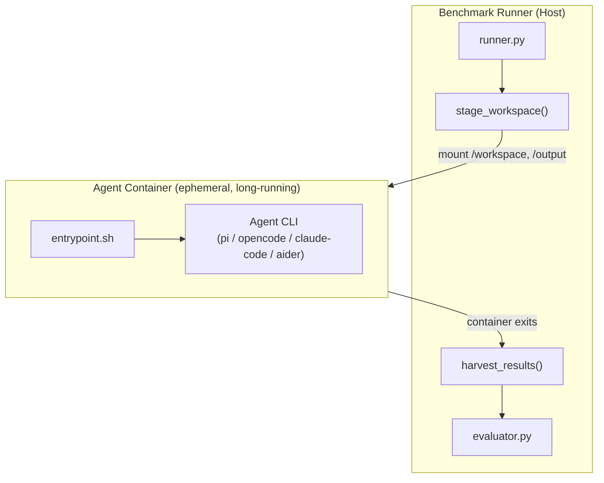

# Agent Container System

Replaces the Python adapter layer (`silverquillm/adapters/`) with Docker-based black-box agent containers. Each agent (Pi, OpenCode, Claude Code, Aider, etc.) ships as a self-contained Docker image. The benchmark runner stages a workspace, launches the container, waits for it to exit, and harvests results. The runner has zero knowledge of agent internals.

The container receives the full benchmark workload — all cards, the engine, the rulebook, and reference implementations — in a single session. This tests agents on realistic long-running coding tasks, not synthetic one-file-at-a-time prompts.

See also:

- [WORKSPACE-CONTRACT.md](https://www.notion.so/ad4d407fda954387adf7eb4ba8674371) for the canonical Workspace layout and card/engine edit contract.
- [RUN-ARTIFACTS-AND-TELEMETRY.md](https://www.notion.so/1ffe911b65564fa6860b2a91dcc94fb5) for snapshots, telemetry, fallback, and log artifacts.
## Motivation

The current adapter-based architecture suffers from structural isolation problems:

- **Workspace contamination** — The agent runs inside the repo tree and can read reference implementations, test suites, and harness code (Issues #5, #16).
- **False-positive violations** — Tool caches (`.pytest_cache`, `__pycache__`) trigger contamination detection (Issues #6, #17).
- **Fragile cleanup** — Stale workspace state, orphan processes, and incomplete file harvesting on violations (Issues #9, #15, #22).
- **Adapter complexity** — Each agent requires a Python adapter class (`opencode.py`, etc.) that manages subprocess lifecycle, config generation, streaming, and timeout enforcement. The `ThreadPoolExecutor` timeout hack breaks output streaming (Issue #18).
- **Artificial task scoping** — The per-card, per-prompt model doesn't test long-running agent capabilities: task planning, knowledge accumulation across cards, self-pacing, and context endurance.
The container model eliminates these problems by making isolation a property of the execution environment and giving the agent a realistic, project-scale workload.

## Architecture



## Workspace Layout

The runner stages a workspace that resembles a real codebase. Every card directory — FDN (examples) and SOS (targets) — has the same structure: `card_spec.json` and `card_impl.py`. The only difference is that FDN implementations are filled in and SOS implementations are empty templates.

FDN cards serve as in-context examples. The agent learns implementation patterns by reading completed code, not from lengthy instructions. No test files are included for FDN — agents must devise their own testing approach for SOS cards.

Immediately before launch, the runner writes `/workspace/run_manifest.json`:

```json
{
  "timeout_seconds": 7200,
  "deadline_utc": "2026-05-13T22:22:00Z"
}
```

This manifest is advisory runtime context only. It is not agent configuration; mode, strategy, model selection, and prompt behavior remain baked into the image.

```javascript
/workspace/
  prompt.md                          # Single input prompt
  run_manifest.json                  # Advisory runtime timeout facts
  rulebook.md                        # Comprehensive MTG rules reference
  engine/                            # Game engine source (read-write copy)
  engine_api.md                      # Engine API reference
  base_classes.py                    # CardImpl base class source
  test_utils.md                      # Test utility reference
  cards/
    fdn/                             # FDN cards — completed examples
      001/
        card_spec.json               # Card data (name, cost, type, rules text)
        card_impl.py                 # Completed implementation (example)
      002/
        card_spec.json
        card_impl.py
      ...
    sos/                             # SOS cards — benchmark targets
      001/
        card_spec.json               # Card data
        card_impl.py                 # Empty template (agent fills this in)
      002/
        card_spec.json
        card_impl.py
      ...
/output/                             # Progress and logs (mounted volume)
  progress.jsonl                     # Per-card status updates (agent writes)
  stdout.log                         # Captured stdout
  stderr.log                         # Captured stderr
```

## Prompt

The input prompt is minimal and natural — like handing a developer a codebase:

> Implement all SOS cards in `/workspace/cards/sos/`. Each card directory contains a `card_spec.json` with the card's details and a `card_impl.py` template to fill in.

> 

> Use the completed FDN cards in `/workspace/cards/fdn/` as implementation examples. Refer to `rulebook.md` for detailed game rules and `engine_api.md` for the engine API.

The prompt does not dictate ordering, strategy, or iteration approach. The agent decides how to tackle the workload. This tests planning and self-management, not just code generation.

## Entrypoint: Orchestration Layer

The entrypoint script owns all orchestration decisions. The agent CLI, mode (blind vs. tested), and strategy (all-at-once, sequential, by-tier) are all baked into the Docker image. The only runtime inputs are API credentials and an optional timeout hint.

```bash
#!/bin/bash
set -euo pipefail

mkdir -p /output

# Prompt is baked into the image (mode-specific)
PROMPT=$(cat /workspace/prompt.md)
PROMPT="$PROMPT\n\nAfter implementing each card, write tests and iterate until they pass."

# Invoke the agent (agent CLI is pre-installed in image)
run_agent "$PROMPT" /workspace

echo $? > /output/exit_code
```

Different images encode different configurations. For example, `silverquillm-opencode-tested:latest` bakes in OpenCode + tested mode, while `silverquillm-opencode-blind:latest` bakes in OpenCode + blind mode. A sequential variant would have a different entrypoint that loops over cards. The runner doesn't know or care about these differences.

## File-Based Contract

The contract between the runner and any agent image is defined entirely by mounted volumes, API credential env vars, and output conventions.

### Inputs

| Input | Mechanism | Description |
| --- | --- | --- |
| Workspace | Volume mount (`/workspace`) | Full workspace: prompt, cards, engine, rulebook, docs |
| Run Manifest | `/workspace/run_manifest.json` | Advisory timeout facts: `timeout_seconds` and `deadline_utc` |
| Output dir | Volume mount (`/output`) | Agent/process output channel for extra telemetry: progress logs, stdout, stderr, exit code |
| API credentials | Env vars | `OPENAI_API_KEY`, `ANTHROPIC_API_KEY`, etc. |

Agent CLI, mode, strategy, model selection, and prompt are all baked into the image. The runner passes only the workspace, output directory, and API keys.

### Outputs (harvested by runner)

| Path | Description |
| --- | --- |
| `/workspace/cards/sos/*/card_impl.py` | Agent's card implementations (overwrites templates) |
| `/workspace/cards/sos/*/tests.py` | Agent's test suites (if `tested` mode) |
| `/workspace/engine/` | Agent's modified engine, diffed against the host baseline engine for `engine_diff.patch` |
| `/output/progress.jsonl` | Per-card status updates (for live monitoring) |
| `/output/stdout.log` | Captured stdout |
| `/output/stderr.log` | Captured stderr (thinking, tool calls) |
| `/output/exit_code` | Numeric exit code |

The Output Directory is observability-only. It pipes agent and process output out of the container for live monitoring and post-run debugging. It must not contain card implementations, tests, engine changes, or any artifact required for scoring.

No files in `/output/` are required. The runner must tolerate an empty Output Directory. `progress.jsonl`, `system.log`, `agent_stdout.log`, `agent_stderr.log`, and `exit_code` are optional conventions for telemetry and debugging only.

The runner still captures Docker process stdout and stderr at the host level and saves them in the run results, for example as `docker_stdout.log` and `docker_stderr.log`. This provides debugging logs even when the entrypoint writes nothing to `/output/`. These logs are telemetry-only and not evaluatable state.

Docker stdout and stderr are streamed live to the terminal while also being saved to run result logs. This gives live visibility during long runs and preserves logs for post-run debugging.

Live terminal output should be lightly labeled and colorized by output type, for example stdout, stderr, snapshot telemetry, and runner/system messages. Saved `docker_stdout.log` and `docker_stderr.log` remain plain split-stream logs; color is for terminal readability, not persisted evaluation state.

Colorization defaults to `--color auto`: enabled for interactive TTY output and disabled when output is piped or running in CI. The runner should also support `--color always` and `--color never` overrides.

For v1, live labeled/colorized streaming plus saved split logs and `snapshot_telemetry.jsonl` are sufficient. A separate post-run `logs --run` viewer is deferred until the runner is stable.

## Progress Monitoring

The entrypoint or agent may write incremental progress to `/output/progress.jsonl`. This is recommended for live monitoring, but not required for correctness. Since `/output` is a mounted volume, the runner can tail it in real time when present:

```json
{"card_id": "042", "card_name": "Ajani's Response", "status": "started", "ts": "2026-05-13T01:15:00Z"}
{"card_id": "042", "card_name": "Ajani's Response", "status": "tests_passing", "ts": "2026-05-13T01:28:00Z"}
{"card_id": "042", "card_name": "Ajani's Response", "status": "completed", "ts": "2026-05-13T01:29:00Z"}
{"card_id": "011", "card_name": "Eager Glyphmage", "status": "started", "ts": "2026-05-13T01:29:30Z"}
```

Stdout and stderr are also on the mounted volume and can be tailed for live agent thinking and tool call output.

The runner must tolerate missing or malformed `progress.jsonl`. Filesystem artifacts remain the source of truth for whether an implementation exists; progress events only refine status such as `completed` vs `partial`.

## Container Lifecycle

1. **Stage** — Runner creates workspace on host: copies engine, rulebook, FDN cards (filled), SOS cards (empty templates), prompt, and reference docs.
2. **Run** — Runner calls `docker run` with workspace and output volumes mounted. The call blocks until the container exits. The agent runs for the duration of the entire benchmark (potentially hours).
3. **Harvest** — Runner walks `/workspace/cards/sos/*/` and collects `card_impl.py` and `tests.py` from each card directory. Diffs `/workspace/engine/` against the host baseline engine for engine patches.
4. **Evaluate** — Runner runs the audited test suite against each harvested `card_impl.py` independently (outside the container).
5. **Cleanup** — Runner removes workspace and output directories.
Filtered runs may stage only a subset of SOS target card directories for debugging, but FDN examples remain staged in full. Filtered runs are development or Pipeline Validation Runs, not leaderboard-valid benchmark runs.

Implementation sketch:

```python
container_name = f"sqm-{run_name}"
write_run_manifest(workspace, timeout_seconds=timeout, deadline_utc=deadline)

proc = subprocess.Popen(
    [
        "docker", "run", "--rm", "--name", container_name,
        "-v", f"{workspace}:/workspace",
        "-v", f"{output_dir}:/output",
        *api_key_env_args(),
        image,
    ],
    stdout=subprocess.PIPE,
    stderr=subprocess.PIPE,
    text=True,
)

try:
    stream_docker_logs_live(proc)
    proc.wait(timeout=timeout)
except subprocess.TimeoutExpired:
    subprocess.run(["docker", "stop", "-t", "10", container_name], check=False)
    proc.wait(timeout=30)
finally:
    selected_workspace = select_final_or_snapshot_workspace(workspace)
    materialize_workspace_final(selected_workspace, results_dir / run_name / "workspace_final")
```

## Timeout Enforcement

The runner owns the hard timeout. Docker's `--stop-timeout` is only a grace-period setting; it does not automatically stop a container after the benchmark timeout.

Required timeout mechanism:

1. Immediately before `docker run`, write `/workspace/run_manifest.json` with `timeout_seconds` and `deadline_utc`.
2. Launch the container with `subprocess.Popen`, not `subprocess.run(timeout=...)`.
3. Wait with `proc.wait(timeout=timeout_seconds)`.
4. On `TimeoutExpired` or `KeyboardInterrupt`, call `docker stop -t 10 <container_name>`.
5. Harvest the final Workspace and optional `/output/` telemetry after the container exits.
6. Use snapshot fallback if the final Workspace is not viable.
The container may read the Run Manifest for pacing or graceful shutdown, but benchmark correctness must not depend on container cooperation.

## Authentication

Agent credentials are passed as environment variables at `docker run` time:

| Agent | Auth mechanism | Environment variable(s) |
| --- | --- | --- |
| Pi + local model (default) | Baked into `models.json` | None (model server at LAN IP, e.g. `192.168.86.22:8080`) |
| Pi + cloud API | API key | `OPENAI_API_KEY` or `ANTHROPIC_API_KEY` |
| OpenCode + local model | API endpoint URL | `OPENAI_BASE_URL`, `OPENAI_API_KEY` |
| OpenCode + cloud API | API key | `OPENAI_API_KEY` or `ANTHROPIC_API_KEY` |
| Claude Code | API key (headless) | `ANTHROPIC_API_KEY` |
| Aider | API key | `OPENAI_API_KEY`, `ANTHROPIC_API_KEY`, etc. |

Interactive/browser-based OAuth flows are not supported inside containers. All agents must use headless API-key authentication.

For local models running on the host, use the LAN IP directly (e.g. `192.168.86.22:8080`) with `--runtime=runc`. Avoid `host.docker.internal` (doesn't resolve on Linux).

## Agent Image Structure

Each agent image contains:

- The agent CLI tool (pre-installed)
- An `entrypoint.sh` that reads config, sets up the agent, and manages the run
- Agent-specific configuration (non-secret)
### Example: Pi image (default agent)

```docker
FROM node:20-slim
RUN npm install -g @earendil-works/pi-coding-agent
WORKDIR /app
COPY models.json /app/models.json
COPY entrypoint.sh /entrypoint.sh
RUN chmod +x /entrypoint.sh
ENV SILVERQUILLM_MODE=blind
ENTRYPOINT ["/entrypoint.sh"]
```

Pi uses CLI print mode (`pi -p`) for clean stdout/stderr separation. The `models.json` bakes in the model provider config (e.g. local llama.cpp at `192.168.86.22:8080`). Mode is baked as `SILVERQUILLM_MODE` env var.

### Example: OpenCode image

```docker
FROM python:3.12-slim
RUN pip install opencode-ai
COPY entrypoint.sh /entrypoint.sh
RUN chmod +x /entrypoint.sh
ENV OPENCODE_NON_INTERACTIVE=1
ENTRYPOINT ["/entrypoint.sh"]
```

### Example: Claude Code image

```docker
FROM node:20-slim
RUN npm install -g @anthropic-ai/claude-code
COPY entrypoint.sh /entrypoint.sh
RUN chmod +x /entrypoint.sh
ENV CLAUDE_CODE_DISABLE_TELEMETRY=1
ENV CLAUDE_CODE_NON_INTERACTIVE=1
ENTRYPOINT ["/entrypoint.sh"]
```

## Isolation Guarantees

The container model provides structural isolation that replaces application-level contamination checking:

| Threat | Current mitigation | Container mitigation |
| --- | --- | --- |
| Agent reads audited test suites | `_check_violations()` mtime diffing | Test suites don't exist in container |
| Agent reads harness source | `repo_root` config (broken, Issue #16) | Harness doesn't exist in container |
| Agent reads benchmark results | `_is_allowed_path()` allowlist | Results don't exist in container |
| Tool cache false positives | `_IGNORED_DIRS` set (Issues #6, #17) | No contamination checker needed |
| Stale state between runs | Manual cleanup (Issue #9) | Fresh container per run |
| Orphan processes | Signal handler (Issue #22) | `docker stop` kills all processes |

Note: FDN card implementations are intentionally accessible — they serve as examples, not contamination. SOS cards are the benchmark target, and their audited test suites (used for evaluation) exist only on the host, never inside the container.

## Engine Modifications

Some cards require engine extensions (new hooks, additional player attributes, etc.). The agent modifies files in `/workspace/engine/` freely. The baseline engine remains on the host side, outside the container. After the run, the runner diffs the harvested `/workspace/engine/` against the host baseline engine to produce `engine_diff.patch`. The evaluator uses the harvested or snapshot-fallback engine when running the audited test suite.

## Runner-Owned Snapshots

The runner captures periodic Workspace-only snapshots during execution, approximately once per minute. Snapshots are stored as host-side Git commits outside the mounted Workspace; the container never sees the `.git` directory.

Snapshots are used for:

- **Recovery** — If final engine code is corrupted or scrambled, the runner may walk backward through snapshot commits until audited engine tests pass.
- **Progress telemetry** — After each snapshot, the runner can emit a short summary of which SOS card implementations or tests changed since the prior snapshot.
Recovery uses the entire selected Workspace snapshot. The runner does not roll back only `/workspace/engine/` while keeping final card implementations, because that would create a combination the agent never produced.

After final harvest or snapshot fallback selection, the runner materializes the official evaluation Workspace as `results/{run_name}/workspace_final/`. This gives humans and the evaluator a stable directory path without requiring Git commands. If no fallback was used, `workspace_final/` is the final harvested Workspace. If fallback was used, `workspace_final/` is the selected snapshot Workspace.

`workspace_final/` contains the entire Workspace tree, not a reduced evaluation subset. Keeping prompt, Run Manifest, reference docs, FDN examples, SOS outputs, and engine state together preserves the coherent agent-produced state for evaluation and audit.

The Workspace card structure is part of the contract. Agents may edit `card_impl.py`, optional `tests.py`, and engine files, but must preserve `cards/{set}/{card_id}/card_spec.json` and the containing card directories. If an agent restructures card directories, evaluation may fail or mark affected cards as no output; the runner does not reconstruct legacy per-card artifacts from arbitrary moved files.

FDN examples and SOS targets use the same card directory contract. FDN `card_impl.py` files are filled reference implementations; SOS `card_impl.py` files start as templates that agents fill in. Keeping the shape identical makes examples directly comparable to targets.

After FDN migration, legacy monolithic `cards/foundations/` files should not be staged into the agent Workspace. Agents should see only the per-card FDN structure (and any approved set-level helpers), so FDN examples mirror SOS targets without duplicate implementation sources.

The repository may keep `cards/foundations/` temporarily during migration as source material while `cards/fdn/{card_id}/card_impl.py` files are populated and registry/tests are updated. This is a repo migration convenience only; the agent Workspace should remain clean once per-card FDN examples are ready. Delete the legacy layout after tests pass and no imports remain.

FDN `card_impl.py` files should be mostly self-contained. Card-specific logic belongs in the card's own file. Generic reusable helpers may live in `cards/fdn/utils.py`, but avoid cross-card imports between FDN card directories; hidden dependency chains make examples harder for agents to learn from and harder for the runner to stage and evaluate.

Shared helper files are allowed as long as each card class remains in the expected card file and folder. The hard contract is that the canonical implementation class for a card is importable from `cards/{set}/{card_id}/card_impl.py`. Helpers may live beside the set, for example `cards/fdn/utils.py` or `cards/sos/utils.py`, but cross-card directory imports should be avoided.

The agent prompt should state the hard location rule only: each card's implementation class must remain in its assigned `cards/sos/{card_id}/card_impl.py`, and card directories must not be moved or renamed. The prompt does not need to mention shared helper files.

Card directory restructuring is normally a card-level failure. If one expected `card_impl.py` is missing or moved, that card is marked no output or fails evaluation. If many cards are moved, those cards fail individually. Only broad Workspace destruction, such as a missing `cards/sos/` tree, is a run-level structural failure. Missing or unusable `engine/` follows the engine viability and snapshot fallback flow.

Evaluation reads from `results/{run_name}/workspace_final/` as the official source. Any legacy per-card artifacts under `results/{run_name}/cards/{card_id}/` are optional derived convenience outputs and are not a recovery mechanism for broken Workspace structure.

Snapshot fallback selection uses Engine Regression only (`tests/engine/`) as the viability gate. FDN Card Regression and SOS Card Correctness are evaluated after selection, not used to choose the snapshot.

Snapshot fallback triggers when final `tests/engine/` fails, errors on import, times out, hangs, or cannot start because engine files are corrupted. A snapshot is viable only if `tests/engine/` completes and passes within the normal engine-test timeout.

If no snapshot is viable, the run is marked `no_viable_output_produced`. This means the agent broke the engine before the first viable snapshot, so the runner does not evaluate SOS or FDN card correctness for that run.

Even when no viable output is produced, the runner preserves the broken final Workspace for debugging. The run is not evaluatable, but the failure state remains inspectable.

`no_viable_output_produced` is a run-level status only. The runner does not assign per-card statuses when there is no coherent evaluatable Workspace.

For v1, snapshots are captured on a fixed 60-second interval. The runner does not use file-watch-triggered snapshots; fixed cadence is predictable and avoids noisy Docker volume filesystem events.

Each snapshot commits the full Workspace tree and relies on Git deduplication for unchanged content. This keeps fallback simple: a selected snapshot is a complete Workspace checkout. Empty commits may be skipped, but the runner still emits telemetry every 60 seconds.

Snapshot telemetry is written both to the console and to `snapshot_telemetry.jsonl` in the run results directory. Console output gives live progress to the human operator; JSONL enables post-run analysis and charts.

Each telemetry event includes both delta fields and cumulative total fields. Delta fields answer "what changed this minute"; total fields answer "how far through the run is the agent overall." Track changed card implementations, changed card tests, and changed engine files in both forms.

Telemetry distinguishes activity from coverage: `changed_card_impls` means changed since the previous snapshot, while `completed_like_card_impls` means the card implementation differs from the original template. Track both concepts rather than overloading one field.

Telemetry must not parse or import agent code. It is filesystem-based only. Syntax errors, import errors, and logic errors are measured by evaluation, not by snapshot telemetry.

Engine activity telemetry includes both changed file paths and counts. Cap path lists, for example at 50 files, and include a truncation flag plus full count when the cap is exceeded. This keeps live telemetry useful without allowing huge events when an agent rewrites or reformats many engine files.

Card activity telemetry uses card directory IDs only, not card names. Keep telemetry lightweight; downstream tools can resolve names from `card_spec.json` if needed.

Test file activity is tracked separately from implementation activity. `changed_card_tests` contains card IDs whose `tests.py` changed since the previous snapshot. This is especially useful for Tested Mode; Blind Mode should usually leave the field empty.

## Code Eliminated

The following modules and logic are replaced by the container system:

- `silverquillm/adapters/` — Entire directory ([opencode.py](http://opencode.py/), [base.py](http://base.py/), etc.)
- `silverquillm/agent_session.py` — `setup_workspace()`, `_check_violations()`, `_snapshot_mtimes()`, `_is_allowed_path()`, `_IGNORED_DIRS`, `harvest_results()`, `cleanup()`
- `silverquillm/strategies.py` — `ThreadPoolExecutor` timeout logic, `BlindStrategy`/`ImplTestStrategy` adapter orchestration
- `silverquillm/preflight.py` — `_check_workspace_isolation()` canary test (isolation is structural)
- `silverquillm/prompts.py` — Per-card prompt rendering (replaced by single workspace-level prompt)
## Image Naming Convention

```javascript
silverquillm-{agent}-{mode}:{version}
```

Examples:

- `silverquillm-pi-blind:latest`
- `silverquillm-pi-tested:latest`
- `silverquillm-opencode-tested:latest`
- `silverquillm-opencode-blind:latest`
- `silverquillm-claude-code-tested:latest`
- `silverquillm-aider-tested-sequential:latest`
The image name encodes the full configuration: agent, mode, and optionally the strategy variant. The runner uses the image name as the run identifier.

## Adding a New Agent

To add a new agent to the benchmark:

1. Create `docker/{agent}-{mode}/Dockerfile` — install the agent CLI, bake in mode and prompt
2. Create `docker/{agent}-{mode}/entrypoint.sh` — set up agent, invoke it, capture output
3. Build: `docker build -t silverquillm-{agent}-{mode}:latest docker/{agent}-{mode}/`
4. Run: `python -m silverquillm run --image silverquillm-{agent}-{mode}:latest --timeout 7200`
No Python adapter code needed. The runner only knows about the file-based contract.

## Hello World Benchmark

A minimal smoke test to verify that an agent container works before running the full benchmark. The runner stages an empty workspace with a trivial prompt ("Create a file `hello.py` that prints 'Hello, world!'") and launches the container. If the container produces `hello.py` with the expected output, the image is validated.

This catches:

- Broken Dockerfile builds
- Misconfigured entrypoints
- Missing agent CLI installations
- Authentication failures (API keys not passed correctly)
- Volume mount issues
Run before every real benchmark to avoid wasting hours on a broken image.

```bash
python -m silverquillm smoke --image silverquillm-pi-blind:latest
```

## What This Tests (Beyond Code Generation)

By giving the agent the full workload in a single session, the benchmark additionally evaluates:

- **Task planning** — Does the agent start with simple cards to build momentum?
- **Knowledge accumulation** — Does implementing card 5 help with card 30?
- **Self-pacing** — Does the agent know when to move on vs keep iterating?
- **Long-context endurance** — Does quality degrade over a multi-hour session?
- **Engine understanding** — Can the agent extend the engine when needed, and do those extensions compose across cards?
- **Test design** — Without example tests to copy from, does the agent write meaningful tests that exercise the card's actual mechanics?
