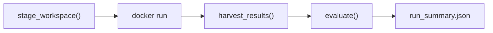

Status: DRAFT (rewritten for container architecture)

Last updated: 2026-05-30

# Benchmark Runner

Orchestration harness for the end-to-end benchmark. The runner stages a workspace, launches an agent container, harvests results, and runs evaluation. It has no knowledge of agent internals.

**Run shape**: a Benchmark Run is one container session that consumes the benchmark's **entire** problem set in a single Workspace (run spec = candidate + mode + benchmark + budget, per #39). Card-subset ("workload") runs are retired (Grilling 2026-08-27); cheap validation uses the dedicated smoke benchmark (`benchmarks/smoke/`).

## Context

The runner is the host-side orchestrator. It prepares everything the agent needs, launches a Docker container, waits for it to finish, and evaluates the results. All agent-internal orchestration (prompt handling, mode selection, iteration strategy) lives inside the container's entrypoint. See [AGENT-CONTAINERS.md](AGENT-CONTAINERS.md) for the container architecture.

Detailed contracts are split into focused specs:

- [WORKSPACE-CONTRACT.md](WORKSPACE-CONTRACT.md) defines the Workspace layout, Run Manifest, card directory invariant, and in-place engine editing model.
- [RUN-ARTIFACTS-AND-TELEMETRY.md](RUN-ARTIFACTS-AND-TELEMETRY.md) defines `workspace_final/`, snapshot fallback, telemetry, Docker logs, and smoke runs (the `silverquillm smoke` command vs. the smoke benchmark).
## Architecture



## Runner CLI

The Docker image *is* the full agent configuration — it bakes in the agent CLI, mode (blind/tested), strategy, model, and prompt. There is no `config.yaml` and no `MODE`/`STRATEGY` environment variables; the runner passes only the workspace, output directory, timeout, and API keys. The runner's only job is to stage the workspace, launch the image, and harvest results.

Two benchmark modes exist — blind (implementation only) and tested (implementation plus tests) — each baked into a separate Docker image, and modes are compared across separate runs. Both modes produce `card_impl.py`; in blind mode the agent devises its own testing approach.

```bash
python -m silverquillm run \
  --image silverquillm-pi-blind:latest \
  --timeout 7200 \
  --hang-timeout 900 \
  --cards 001,042,105
```

| Argument | Description |
| --- | --- |
| `--image` | Docker image to run (encodes agent + mode + strategy) |
| `--timeout` | Hard Timeout: total run time limit in seconds |
| `--hang-timeout` | Hang Timeout: seconds of no file activity before stopping (default: 900) |
| `--cards` | [SUPERSEDED — Grilling 2026-08-27] Legacy entrypoint lineage only (retired in #66): comma-separated SOS collector numbers to stage. Card-subset runs are retired; a Benchmark Run stages the whole problem set |
| `--color` | Live log colorization: `auto` (default — enabled for interactive TTY, disabled for pipes/CI), `always`, or `never` |

The workspace source directory is a repo-relative constant (`./benchmarks/sos/workspace/`); it is not configurable via CLI flags. On the legacy `--cards` lineage, collector numbers are accepted zero-padded (e.g. `001`, `042`); CLI parsing normalizes them via `str(int(x))`, preserves non-numeric values as-is, and card directory names use the normalized form.

## Benchmark Config (`config.json`)

Each benchmark declares its identity and lifecycle in `benchmarks/<bench>/config.json`. The runner reads it at stage time; CI reads only `tier` (from the base branch) to enforce locks.

```json
{
  "schema_version": 1,
  "id": "sos",
  "display_name": "Secrets of Strixhaven",
  "draft_set": {
    "primary_set_code": "SOS",
    "collector_range": "001-271",
    "extra_set_codes": []
  },
  "tier": "benchmarking",
  "cards": ["001", "004", "013", "057", "097", "120", "201", "226", "245", "257"],
  "leaderboard": {
    "requires_full_set": true,
    "requires_unfiltered": true
  }
}
```

Fields:

- `schema_version` (int) — config schema version, for forward migration.
- `id` (string) — benchmark identity; also the run-name prefix and results-dir scope.
- `display_name` (string) — human-readable set name.
- `draft_set` — the card pool: `primary_set_code`, `collector_range`, and any `extra_set_codes` (a Draft Set may span multiple Scryfall codes).
- `tier` — `beta` | `benchmarking` | `released`. The only field CI reads; expands to locked path-globs (monotonically increasing, CI-enforced lock scope per tier). The benchmark `tier`, never the card-level `complexity_tier`.
- `cards` (array) — the benchmark's canonical scored card set (collector numbers). For v1 this is the 10 audited SOS cards (`001`, `004`, `013`, `057`, `097`, `120`, `201`, `226`, `245`, `257`), and the v1 "full set" is exactly these — a leaderboard-valid run must stage all of them. Named `cards` to avoid collision with the run-level `card_filter` in `run_summary.json` (the per-run `--cards` selection, `null` when unfiltered).
- `leaderboard.requires_full_set` (bool) — a leaderboard-valid run must stage every card in `cards`.
- `leaderboard.requires_unfiltered` (bool) — a leaderboard-valid run must run with no narrower `--cards` filter (run-level `card_filter = null`).
- `leaderboard.eligible` (bool, optional; default `true`) — when `false`, the benchmark is **never leaderboard-published**, whatever the run shape. Set on the smoke benchmark (`benchmarks/smoke/`), a pipeline-validation / candidate-calibration benchmark run like any other but whose results never enter a leaderboard.

Leaderboards exclude filtered runs by default. On the retired legacy entrypoint lineage, the `--cards` filter selected SOS targets only (FDN examples stayed staged in full) and served development, debugging, and Pipeline Validation Runs, with `run_summary.json` recording the filter (grilling 2026-08-27).

Not in config: workspace/test paths (resolved from the `_REPO_ROOT` / `_BENCHMARK_SET_ROOT` constants) and complexity weights (v1 scoring is unweighted pass/total).

Path resolution flows through module-level constants, not CLI flags — there are no `--cards-dir` / `--engine-dir` style flags. Host-side modules that resolve repo-relative paths (`cli.py`, `workspace.py`) define `_REPO_ROOT = Path(__file__).resolve().parent.parent`, and all repo-relative resolution flows through it. `silverquillm/workspace.py` defines `_BENCHMARK_SET_NAME = "sos"` and `_BENCHMARK_SET_ROOT = _REPO_ROOT / "benchmarks" / _BENCHMARK_SET_NAME`; all bench-side, set-scoped paths flow through `_BENCHMARK_SET_ROOT` (workspace source = `_BENCHMARK_SET_ROOT / "workspace"`, audited tests = `_BENCHMARK_SET_ROOT / "data" / "tests" / "audited"`). When a second target set ships (Foundations 2, etc.), `_BENCHMARK_SET_NAME` is promoted to a CLI flag (`--set`, default `sos`) with no other path call site changing — funneling every set-scoped path through one constant keeps the runner benchmark-agnostic.

## Workspace Staging

The runner builds a workspace directory that the container sees as `/workspace/`. See [AGENT-CONTAINERS.md](AGENT-CONTAINERS.md) for the full workspace layout.

Staging steps:

1. Recursively copy `benchmarks/sos/workspace/` from the bench repo into a per-run tmp directory.
2. Write `workspace/prompt.md` (User Prompt) and `workspace/run_manifest.json` (`timeout_seconds` + `deadline_utc`) into the copy. The manifest write happens immediately before container launch.
3. Run `git init && git add -A && git commit -m "initial workspace"` inside the copy so the agent has clean version-control state and Output Snapshots have a base commit.
4. Mount the copy at `/workspace/` when launching the agent container.

The User Prompt is a single `prompt.md` covering the entire card set (this replaces per-card prompt rendering); mode-specific instructions are appended by the container entrypoint, which also carries the baked-in System Prompt. A Benchmark Run always stages the whole problem set, so the prompt lists every target card — on the retired legacy entrypoint lineage the runner adjusted the User Prompt for filtered runs (grilling 2026-08-27).

The source-of-truth layout lives in the bench repo at `benchmarks/sos/workspace/`. To change what agents see, edit that directory — there is no per-file staging logic. FDN and SOS card directories share the same structure (`card_spec.json` + `card_impl.py`). FDN implementations are filled reference code; SOS implementations are SOS Card Stubs (`class CardName(CardImpl): pass`) for the agent to extend. FDN card-specific logic lives in each card's `card_impl.py`; generic reusable helpers may live in `cards/fdn/utils.py`, but cross-card imports between `cards/fdn/{card_id}/card_impl.py` files are avoided so examples stay easy to copy. Illustrative FDN card tests are staged at `tests/cards/fdn/` for agent reference; `tests/cards/sos/` is intentionally empty (audited SOS grader tests live host-side only). See [WORKSPACE-CONTRACT.md](WORKSPACE-CONTRACT.md) for the full layout.

## Resume

`silverquillm resume <prior-run-id>` creates a fresh Benchmark Run that stages from a prior run's `workspace_final/` instead of `benchmarks/sos/workspace/`. The resume is a separate Benchmark Run with its own `run_name`, results directory, Hard Timeout, snapshots, and evaluation — not a continuation of the prior run (grilling 2026-05-30). Legs are linked via `run_summary.json.resumed_from`; the sequence is a Resume Chain.

```bash
python -m silverquillm resume sos-2026-05-16T19-49 \
  --timeout 7200 \
  [--image silverquillm-pi-blind:latest] \
  [--card-filter ...] \
  [--force-missing-summary]
```

Differences from `run`:

- Staging copies the prior run's `workspace_final/` wholesale; no `git init`. Prior `.git` history is preserved. See [WORKSPACE-CONTRACT.md](WORKSPACE-CONTRACT.md) → Resume staging variant.
- `--image` defaults to the prior run's `docker_image`; explicit override allowed (recorded as `resumed_image_changed: true`).
- Runner appends a Resume Preamble to the User Prompt informing the agent that this is a resume. Conditional additional lines disclose snapshot fallback (if used) and image change (if applicable).
- Refuses resumes when prior `run_status` is `no_viable_output_produced` or when `workspace_final/` is missing. A future `--from-snapshots` flag may be added for borderline cases.
- Accepts resumes from runs that used snapshot fallback; the Resume Preamble discloses the rollback so the agent knows its inherited state is not where the prior agent stopped.
Resume Legs are never leaderboard-valid — any run with `resumed_from` set has `leaderboard_valid = false`. See [RUN-ARTIFACTS-AND-TELEMETRY.md](RUN-ARTIFACTS-AND-TELEMETRY.md) → Run summary.

### Locating the prior run

The CLI argument may be either a full path or a bare `run-id`. If the arg contains `/` or resolves as an existing path, it is used directly. Otherwise the runner globs `docker/*/results/<arg>/` and requires a unique match — zero matches and 2+ matches both error loudly (the latter suggests passing a full path to disambiguate). The image inferred from the resolved path's `<image-dir>` component is cross-checked against `run_manifest.json.docker_image` and `run_summary.json.docker_image` (when present); any mismatch aborts the resume as a corrupted run.

### `--timeout` policy

`--timeout` is required on every `resume` invocation, mirroring `run`. There is no "inherit prior leg's timeout" default — each Resume Leg's budget is an independent, deliberate choice. When `--timeout` is omitted, the error message reads the prior leg's `run_manifest.json` and `run_summary.json` to suggest the prior leg's `--timeout` and wall-clock-used as starting points.

### Snapshot fallback detection

The Resume Preamble's snapshot-fallback disclosure line is driven by reading the prior run's snapshot ledger (under `<prior-run-dir>/snapshots/`), not by reading `run_summary.json`. The ledger is written during the run and survives harvester failure; `run_summary.json` is a post-hoc artifact. Reading the ledger ensures the disclosure (and the `snapshot_utc` value it cites) is accurate even when the prior harvester crashed or wrote a partial summary. This reflects the broader resume read-source preference: run-time artifacts are trusted over post-hoc harvest-time artifacts (grilling 2026-05-30).

### Missing or partial prior `run_summary.json`

Tiered handling:

- If prior `run_manifest.json` is missing, the entire prior run dir is treated as corrupted and resume is refused outright.
- If only prior `run_summary.json` is missing or unreadable, resume requires explicit `--force-missing-summary`. With the flag: the `no_viable_output_produced` refusal check is skipped (best-effort); the `--timeout` error-message hint drops the wall-clock-used line; the Resume Preamble gains an extra line disclosing harvester failure. `--force-missing-summary` is a cousin to a future `--from-snapshots` flag — both are explicit "I know what I'm doing" opt-ins for non-default resume sources.
- Image read-order is `run_manifest.json.docker_image` first, then the resolved path's `<image-dir>` component, then `run_summary.json.docker_image` if present; all three are cross-checked.
### Resume Chain reader

`silverquillm chain <run-id>` (also accepting a path, per the same resolver) walks the `resumed_from` linked list and prints a one-screen table of legs in oldest-first order: `run_name`, `docker_image`, `--timeout`, wall-clock-used, `run_status`, `resumed_from`. Cycle detection errors with "cycle detected at `<run-id>`" (defensive against future bugs writing circular `resumed_from`). The reader exists to give `resumed_from` at least one consumer from day one — telemetry fields without readers tend to drift. Per-leg `git log --oneline` rendering and chain-level aggregation are deliberately out of scope for v1.

### Chain depth and forks

Resume Chains have no maximum depth; resuming a Resume Leg is identical to resuming a fresh run, and the chain reader walks ancestry through any number of `resumed_from` links.

Resume Chains are trees, not linked lists. The same prior run may be resumed multiple times, producing sibling legs with the same `resumed_from` (useful for A/B comparison of different `--image` choices or `--timeout` budgets from the same starting state). `resumed_from` stays scalar (one immediate parent per leg) — there is no merge semantic. The v1 chain reader walks ancestry only; forward-walking from a root to find descendants of a given leg is v2 scope.

### Cross-image resume

When `--image` differs from the prior leg, the runner prints a stderr warning at staging time including both image names, the prior leg's `run_status`, and wall-clock-used as breadcrumbs for the operator. The resume itself is not blocked — the operator already passed `--image` explicitly. The stderr warning prevents the typo case; the Resume Preamble discloses the change to the agent; `run_summary.json` records `resumed_image_changed: true`.

### `--cards` filter

`--cards` on resume defaults to none (full set), exactly like `silverquillm run`. There is no inheritance from the prior leg's `card_filter` — each Resume Leg's scope is an independent, deliberate choice (mirrors the `--timeout` policy). When this leg's filter differs from the prior leg's, the Resume Preamble gains a conditional line disclosing that prior-implemented cards outside the new filter are inherited workspace state, not part of this leg's scope.

### Resume Preamble structure

The Resume Preamble is prepended to `prompt.md` under a `## Resume context` heading, followed by a `---` separator and the original User Prompt body. Top placement gives the agent context-before-task; the heading makes the Preamble grep-able and audit-friendly across legs.

Always included: a base statement that this is a resume of `<prior-run-id>`, prior tests/implementations may exist in the workspace, the `.git` history records prior commits, and the agent should inspect current state before doing new work.

Conditional additional lines:

- **Snapshot fallback**: when the prior leg used snapshot fallback, disclose the rollback and the `snapshot_utc` (read from the snapshot ledger, not from `run_summary.json`).
- **Image change**: when `--image` differs from prior, warn the agent that workspace tracking files may follow the prior agent's conventions. The operator-side stderr warning is separate.
- **Filter mismatch**: when this leg's `--cards` differs from the prior leg's `card_filter`, disclose that prior-implemented cards outside the new filter are inherited state, not in scope.
- **Missing summary**: when `--force-missing-summary` was passed, disclose that prior harvester output was unavailable and some run metadata could not be carried forward.
## Container Launch

The runner calls `docker run` with the workspace and output directories mounted as volumes, and API credentials passed as environment variables. The call blocks until the container exits.

Timeout is enforced at multiple levels:

1. **Hard Timeout** — The runner records the start time (monotonic clock), computes `deadline_utc`, writes `/workspace/run_manifest.json`, and checks elapsed time each poll iteration. When the deadline passes, the runner stops the container. Timeout is clock-based, not `proc.wait()`-based: the main thread compares `time.monotonic()` against the deadline each poll iteration rather than blocking on the Popen API, decoupling timeout from `proc.wait(timeout)` and leaving room for future pause/resume via `docker pause`/`docker unpause`.
2. **Hang Timeout** — The runner tracks the last modification time across all monitored files (Docker pipe dumps, `/output/` files). If no file activity occurs for `--hang-timeout` seconds (default 900), the runner stops the container. This catches agent death, API outages, and infinite loops without false-positiving on long thinking pauses.
3. **Docker shutdown grace period** — On either timeout (or `KeyboardInterrupt`), the runner calls `docker stop -t 10 <container_name>`. Docker sends `SIGTERM`, waits 10 seconds, then sends `SIGKILL` if needed.
4. **Container advisory timeout** — The container may read `/workspace/run_manifest.json` for pacing or graceful wrap-up, but benchmark correctness does not depend on it.
On timeout, the runner still harvests partial results and the latest usable Output Snapshot. Completed cards are evaluated normally. Partial cards may be evaluated if importable but retain `partial` status.

The runner uses a pipe-readers + poll-loop architecture: two dedicated threads drain the Docker stdout/stderr pipes to host files, while the main thread polls all monitored files (Docker log dumps, `/output/` files) on a roughly 1-second interval to produce colorized terminal output, check timeouts, and run snapshots. This avoids pipe-buffer deadlock while keeping the main loop single-threaded and simple.

The runner streams Docker stdout/stderr live to the terminal while also saving them as `docker_stdout.log` and `docker_stderr.log` in the run results, supporting long-run monitoring and post-run debugging without container cooperation. Live lines are prefixed with stream labels and colorized by output type (colorization follows `--color`, default `auto`); the saved log files stay split by stream and carry no ANSI color codes. v1 also ships a tabbed post-run log viewer, `silverquillm logs --run`, with tabs over the per-channel files (see [RUN-ARTIFACTS-AND-TELEMETRY.md](RUN-ARTIFACTS-AND-TELEMETRY.md) → Terminal channels); live labeled streaming remains the default, and the originally deferred viewer was lifted once the runner stabilized and a run surfaced concrete triage pain (grilling 2026-05-23).

## Result Harvesting

After the container exits, the runner selects the official evaluation Workspace and materializes it at `docker/<image-dir>/results/<run_name>/workspace_final/`.

The official evaluation Workspace is either:

- the final harvested Workspace, if its engine is viable, or
- the latest viable whole-Workspace snapshot selected by snapshot fallback.
Derived convenience artifacts may also be written, but evaluation always reads from `workspace_final/`. The earlier per-card `cards/{card_id}/result.json` results layout is superseded — see [Historical Context](https://app.notion.com/p/3706a7adc8ed80baafd3e93e28bb6d33). `workspace_final/` is the entire Workspace tree, not only evaluation-relevant files — it preserves the prompt, Run Manifest, docs, FDN examples, SOS outputs, and engine state together for auditability.

The runner also collects telemetry and debugging artifacts:

- `docker_stdout.log` — host-captured Docker stdout
- `docker_stderr.log` — host-captured Docker stderr
- optional `/output/progress.jsonl`
- optional `/output/system.log`
- optional `/output/agent_stdout.log`
- optional `/output/agent_stderr.log`
- optional `/output/exit_code`
`/output/` is an observability channel only. It pipes agent and process output out of the container for extra telemetry and debugging. It is not part of the official evaluation state.

The Progress Log is recommended but not required. Entrypoints and agents may write `progress.jsonl` for live monitoring, but the runner must tolerate missing or malformed progress events.

During container execution, the runner captures periodic Output Snapshots, approximately once per minute. A snapshot records the current Workspace state only. Snapshots provide concrete progress measurement and allow recovery from final Workspace corruption, including scrambled engine code after timeout or interruption. The detailed Output Snapshot cadence, whole-Workspace fallback, and snapshot/telemetry-granularity decisions are archived to [Historical Context](https://app.notion.com/p/3706a7adc8ed80baafd3e93e28bb6d33) and remain in force; the behavior contract is stated here and in Snapshot Fallback below (grilling 2026-05-30).

A card is considered "implemented" if its `card_impl.py` differs from the original template — determined by comparing against the template, not by exit codes or stdout parsing. Cards with unmodified templates are recorded as `no_output`.

A card has output if its `card_impl.py` differs from the original template. Progress events may refine changed output into `completed` or `partial`, but an unchanged template never counts as completed.

## Evaluation Phase

All evaluation is post-run — no evaluation happens during the agent's session. The evaluator runs audited tests only. Agent-written tests are harvested as artifacts but not used for v1 scoring.

Three evaluation dimensions:

1. **SOS Card Correctness** — Run `tests/audited/sos/*/tests.py` against each agent's `card_impl.py` using the harvested agent engine
2. **FDN Card Regression** — Run `tests/audited/fdn/*/tests.py` against pre-filled FDN `card_impl.py` using the harvested agent engine
3. **Engine Regression** — Run `engine_tests/` against the harvested agent engine
The evaluator runs outside the container on the host. For each SOS card:

1. Copy `card_impl.py` to a temp directory
2. Use the harvested agent engine, or a snapshot fallback engine if final engine state is invalid
3. Set `PYTHONPATH` to include the modified engine
4. Run pytest and capture results
### Snapshot Fallback

Output Snapshots are host-side Git commits of the Workspace. The `.git` directory is not mounted into the container.

If the final harvested Workspace has corrupted engine code, the runner may walk backward through snapshot commits until audited engine tests pass. Final-engine viability fallback triggers when `engine_tests/` fails, errors on import, times out, hangs, or cannot start due to corrupted files; snapshot selection walks backward until `engine_tests/` completes and passes within the normal engine-test timeout. The selected snapshot becomes the official harvested Workspace for evaluation. This fallback is narrow: it is for recovering from broken or scrambled final engine state, not for choosing a higher-scoring card implementation.

Snapshot fallback is whole-Workspace fallback, not engine-only fallback. If the runner selects a snapshot commit, evaluation uses that snapshot's `engine/`, `cards/sos/*/card_impl.py`, and `cards/sos/*/tests.py` together. The runner must not combine a final card implementation with an earlier engine snapshot, because that creates an artificial state the agent never produced.

Snapshot selection uses Engine Regression only (`engine_tests/`) as the viability gate. The runner does not require FDN Card Regression or SOS Card Correctness to pass before selecting a fallback snapshot, because that would turn recovery into score-shopping. FDN and SOS failures are evaluated normally after the coherent Workspace is selected.

When snapshot fallback is used, `run_summary.json` records:

```json
{
  "used_snapshot_fallback": true,
  "snapshot_commit": "abc123",
  "snapshot_utc": "2026-05-13T21:44:00Z",
  "fallback_scope": "entire_workspace",
  "fallback_reason": "final engine failed audited engine tests"
}
```

After each snapshot, the runner emits progress telemetry summarizing modified SOS cards, for example: newly modified card directories, total changed implementations, and changed test files.

If no snapshot passes Engine Regression, the run is marked `no_viable_output_produced`. This represents the edge case where the agent broke the engine before the first viable snapshot. The runner does not evaluate SOS or FDN card correctness for that run. Even then, the runner still preserves the broken final Workspace for debugging, though the run is not evaluatable.

### Implementation Compatibility

Every card uses a standardized class name and module path from `template.py`. Tests import from `card_impl`, so any agent's implementation can be swapped in:

```python
from card_impl import StrixhavenProdigy
```

Helpers are allowed, including shared `cards/{set}/utils.py` files, but each card's implementation class must live in that card's expected `cards/{set}/{card_id}/card_impl.py` — evaluation assumes the canonical class is importable from that file. The agent prompt states this hard contract explicitly (each card's class must remain in its assigned `cards/sos/{card_id}/card_impl.py`, and card directories must not be moved or renamed); it need not mention shared helper files.

The runner assumes agents preserve the staged card directory contract (`cards/{set}/{card_id}/card_spec.json`, `card_impl.py`, and optional `tests.py`). If a single card's expected `card_impl.py` is missing or moved, that card is marked no output or fails evaluation, and multiple moved cards fail individually; only broad Workspace destruction (such as a missing `cards/sos/` tree) becomes a run-level structural failure. A missing or unusable `engine/` follows engine viability and the snapshot-fallback flow. Legacy per-card artifacts do not attempt to rescue a broken card structure.

## Result Record

Per-card result after evaluation:

```json
{
    "card_id": "042",
    "card_name": "Ajani's Response",
    "status": "completed",
    "complexity_tier": "medium",
    "audited_eval": {
        "passed": 10, "failed": 2, "total": 12
    },
    "engine_modified": true
}
```

Status values:

- `completed` — `card_impl.py` differs from template and `progress.jsonl` contains `card_completed` for the card, or the run ended cleanly and the implementation is changed.
- `partial` — `card_impl.py` differs from template but the run timed out before a completion signal. Partial cards may still be evaluated if importable.
- `no_output` — template unchanged in a non-timeout run.
- `timeout_no_output` — template unchanged when the run timed out.
### Run status values

`run_summary.json.run_status` is the run-level terminal status (distinct from the per-card status values above):

- `completed` — container exited cleanly; a viable Workspace was evaluated.
- `timeout` — a Hard or Hang Timeout stopped the container; partial results were harvested and evaluated. The companion `timeout_reason` records which fired (`hard_timeout` | `hang_timeout`).
- `crashed` — container exited non-zero before finishing; whatever was written is harvested.
- `launch_failed` — container never started; no results produced.
- `no_viable_output_produced` — engine unusable and no snapshot passed Engine Regression; SOS/FDN correctness skipped. Run-level only — no per-card statuses are assigned.
The model is **terminal status + reason**: `run_status` is always exactly one of the above, and `timeout_reason` (plus the captured exit code for `crashed`) carries the detail.

## Output Artifacts

```javascript
docker/<image-dir>/results/<set_code>-<timestamp>/
├── workspace_final/            # Canonical full Workspace used for evaluation
├── snapshots/                  # Host-side Git snapshot repo for Workspace commits
├── snapshot_telemetry.jsonl    # Snapshot progress telemetry
├── docker_stdout.log           # Host-captured Docker stdout
├── docker_stderr.log           # Host-captured Docker stderr
├── engine_diff.patch           # Engine diff from workspace_final/engine vs baseline
├── run_manifest.json           # Copy of workspace_final/run_manifest.json
├── run_summary.json            # Aggregate stats and run metadata
├── progress.jsonl              # Optional copy from /output/, if present
└── cards/                      # Optional derived convenience artifacts only
    └── 001/
        ├── card_impl.py
        ├── tests.py
        └── result.json
```

Run results are stored under the Docker image directory that produced them, at `docker/<image-dir>/results/<run_name>/`. The run name format is `<set_code>-<timestamp>` (e.g., `sos-2026-05-16T19-49`). The image directory is derived from the `--image` flag by stripping the `silverquillm-` prefix and the `:tag` suffix (e.g., `silverquillm-local-pi-blind:latest` → `docker/local-pi-blind/`). `run_summary.json` is generated after the evaluation phase from the aggregated results and is idempotent and deterministic.

Each run is self-contained. Example:

```javascript
docker/local-pi-blind/results/
├── sos-2026-05-16T19-49/
│   └── ...
├── sos-2026-05-17T10-00/
│   └── ...

docker/homelab-pi-blind/results/
├── sos-2026-05-16T20-30/
│   └── ...
└── ...
```

Cross-agent aggregates (multi-model leaderboard, combined cross-eval) are a future concern and do not live under any image directory.

## Contamination Controls

1. **Container isolation** — Agent runs in a Docker container with only curated files mounted. SOS card tests and FDN card tests do not exist in the container. Engine tests are staged at `workspace/engine_tests/` (reference-only; grading uses host copies). Harness source and benchmark results do not exist in the container.
2. **New set cards** — SOS released 2026-04-24; too new for LLM training data.
3. **No cross-agent leakage** — Each run gets a fresh container with a clean workspace. Agents never see other agents' work.
4. **FDN as examples, not contamination** — FDN implementations are intentionally provided as reference examples. SOS implementations (the benchmark target) are empty templates.
See [AGENT-CONTAINERS.md](AGENT-CONTAINERS.md) → Isolation Guarantees for the full threat model.

## Error Handling

| Scenario | Handling |
| --- | --- |
| Container timeout | Stop the container explicitly, harvest partial results, and use snapshot fallback if final engine state is corrupted; changed unfinished cards recorded as `partial`, unchanged cards as `timeout_no_output` |
| Agent crash (non-zero exit) | Harvest whatever was written; record exit code |
| No output for a card | Template unchanged → `no_output`; scored as zero |
| Engine modifications break tests | Detected during post-run evaluation; reported in results |
| Container won't start | Runner reports launch failure; no results |

## Cost Tracking

The runner tracks per-run metrics (not per-card, since the agent manages its own workflow):

- **Total tokens**: input, output (if reported by agent via progress log)
- **Wall-clock time**: total run duration
- **Per-card estimates**: approximated from `progress.jsonl` timestamps if available

## Relevant ADRs

| ADR | Decision |
| --- | --- |
| [ADR-006](../adr/ADR-006-engine-tests-staged-into-workspace.md) | Engine Tests Staged Into Workspace |
| [ADR-007](../adr/ADR-007-workspace-as-pre-built-directory.md) | Workspace As Pre-Built Directory |
| [ADR-008](../adr/ADR-008-resume-legs-are-independent-benchmark-runs.md) | Resume Legs Are Independent Benchmark Runs |
| [ADR-009](../adr/ADR-009-resume-reads-prefer-run-time-artifacts-over-harvest-time-artifacts.md) | Resume Reads Prefer Run-Time Artifacts Over Harvest-Time Artifacts |
| [ADR-011](../adr/ADR-011-three-tier-benchmark-locking.md) | Three-Tier Benchmark Locking |
