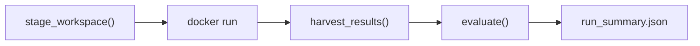

Status: DRAFT (rewritten for container architecture)

Last updated: 2026-05-24

# Benchmark Runner

Orchestration harness for the end-to-end benchmark. The runner stages a workspace, launches an agent container, harvests results, and runs evaluation. It has no knowledge of agent internals.

## Context

The runner is the host-side orchestrator. It prepares everything the agent needs, launches a Docker container, waits for it to finish, and evaluates the results. All agent-internal orchestration (prompt handling, mode selection, iteration strategy) lives inside the container's entrypoint. See [AGENT-CONTAINERS.md](https://www.notion.so/07182a53c93641b7831fe9d240403de3) for the container architecture.

Detailed contracts are split into focused specs:

- [WORKSPACE-CONTRACT.md](https://www.notion.so/ad4d407fda954387adf7eb4ba8674371) defines the Workspace layout, Run Manifest, card directory invariant, and in-place engine editing model.
- [RUN-ARTIFACTS-AND-TELEMETRY.md](https://www.notion.so/1ffe911b65564fa6860b2a91dcc94fb5) defines `workspace_final/`, snapshot fallback, telemetry, Docker logs, filtered runs, and smoke runs.
## Architecture



## Runner CLI

The Docker image *is* the full agent configuration — it bakes in the agent CLI, mode (blind/tested), strategy, model, and prompt. The runner's only job is to stage the workspace, launch the image, and harvest results.

```bash
python -m silverquillm run \
  --image silverquillm-pi-blind:latest \
  --timeout 7200 \
  --hang-timeout 900 \
  --cards 001,042,105
```

| Argument | Description |
| --- | --- |
| `--image` | Docker image to run (encodes agent + mode + strategy) |
| `--timeout` | Hard Timeout: total run time limit in seconds |
| `--hang-timeout` | Hang Timeout: seconds of no file activity before stopping (default: 900) |
| `--cards` | Comma-separated SOS collector numbers to stage (default: all). Filtered runs are not leaderboard-valid |

The workspace source directory is a repo-relative constant (`./benchmarks/sos/workspace/`); it is not configurable via CLI flags.

## Workspace Staging

The runner builds a workspace directory that the container sees as `/workspace/`. See [AGENT-CONTAINERS.md](https://www.notion.so/07182a53c93641b7831fe9d240403de3) for the full workspace layout.

Staging steps:

1. Recursively copy `benchmarks/sos/workspace/` from the bench repo into a per-run tmp directory.
2. Write `workspace/prompt.md` (User Prompt) and `workspace/run_manifest.json` (`timeout_seconds` + `deadline_utc`) into the copy. The manifest write happens immediately before container launch.
3. Run `git init && git add -A && git commit -m "initial workspace"` inside the copy so the agent has clean version-control state and Output Snapshots have a base commit.
4. Mount the copy at `/workspace/` when launching the agent container.
The source-of-truth layout lives in the bench repo at `benchmarks/sos/workspace/`. To change what agents see, edit that directory — there is no per-file staging logic. FDN and SOS card directories share the same structure (`card_spec.json` + `card_impl.py`). FDN implementations are filled reference code; SOS implementations are SOS Card Stubs (`class CardName(CardImpl): pass`) for the agent to extend. Illustrative FDN card tests are staged at `tests/cards/fdn/` for agent reference; `tests/cards/sos/` is intentionally empty (audited SOS grader tests live host-side only). See [WORKSPACE-CONTRACT.md](https://www.notion.so/ad4d407fda954387adf7eb4ba8674371) for the full layout.

## Resume

`silverquillm resume <prior-run-id>` creates a fresh Benchmark Run that stages from a prior run's `workspace_final/` instead of `benchmarks/sos/workspace/`. The resume is a separate Benchmark Run with its own `run_name`, results directory, Hard Timeout, snapshots, and evaluation — not a continuation of the prior run. Legs are linked via `run_summary.json.resumed_from`; the sequence is a Resume Chain. See ADR-008 for design rationale.

```bash
python -m silverquillm resume sos-2026-05-16T19-49 \
  --timeout 7200 \
  [--image silverquillm-pi-blind:latest] \
  [--card-filter ...] \
  [--force-missing-summary]
```

Differences from `run`:

- Staging copies the prior run's `workspace_final/` wholesale; no `git init`. Prior `.git` history is preserved. See [WORKSPACE-CONTRACT.md](https://www.notion.so/ad4d407fda954387adf7eb4ba8674371) → Resume staging variant.
- `--image` defaults to the prior run's `docker_image`; explicit override allowed (recorded as `resumed_image_changed: true`).
- Runner appends a Resume Preamble to the User Prompt informing the agent that this is a resume. Conditional additional lines disclose snapshot fallback (if used) and image change (if applicable).
- Refuses resumes when prior `run_status` is `no_viable_output_produced` or when `workspace_final/` is missing. A future `--from-snapshots` flag may be added for borderline cases.
- Accepts resumes from runs that used snapshot fallback; the Resume Preamble discloses the rollback so the agent knows its inherited state is not where the prior agent stopped.
Leaderboard validity for Resume Legs is deferred — see [RUN-ARTIFACTS-AND-TELEMETRY.md](https://www.notion.so/1ffe911b65564fa6860b2a91dcc94fb5) → Run summary.

### Locating the prior run

The CLI argument may be either a full path or a bare `run-id`. If the arg contains `/` or resolves as an existing path, it is used directly. Otherwise the runner globs `docker/*/results/<arg>/` and requires a unique match — zero matches and 2+ matches both error loudly (the latter suggests passing a full path to disambiguate). The image inferred from the resolved path's `<image-dir>` component is cross-checked against `run_manifest.json.docker_image` and `run_summary.json.docker_image` (when present); any mismatch aborts the resume as a corrupted run.

### `--timeout` policy

`--timeout` is required on every `resume` invocation, mirroring `run`. There is no "inherit prior leg's timeout" default — each Resume Leg's budget is an independent, deliberate choice. When `--timeout` is omitted, the error message reads the prior leg's `run_manifest.json` and `run_summary.json` to suggest the prior leg's `--timeout` and wall-clock-used as starting points.

### Snapshot fallback detection

The Resume Preamble's snapshot-fallback disclosure line is driven by reading the prior run's snapshot ledger (under `<prior-run-dir>/snapshots/`), not by reading `run_summary.json`. The ledger is written during the run and survives harvester failure; `run_summary.json` is a post-hoc artifact. Reading the ledger ensures the disclosure (and the `snapshot_utc` value it cites) is accurate even when the prior harvester crashed or wrote a partial summary. See ADR-009 for the broader read-source principle.

### Missing or partial prior `run_summary.json`

Tiered handling:

- If prior `run_manifest.json` is missing, the entire prior run dir is treated as corrupted and resume is refused outright.
- If only prior `run_summary.json` is missing or unreadable, resume requires explicit `--force-missing-summary`. With the flag: the `no_viable_output_produced` refusal check is skipped (best-effort); the `--timeout` error-message hint drops the wall-clock-used line; the Resume Preamble gains an extra line disclosing harvester failure. `--force-missing-summary` is a cousin to a future `--from-snapshots` flag — both are explicit "I know what I'm doing" opt-ins for non-default resume sources.
- Image read-order is `run_manifest.json.docker_image` first, then the resolved path's `<image-dir>` component, then `run_summary.json.docker_image` if present; all three are cross-checked.
### Resume Chain reader

`silverquillm chain <run-id>` (also accepting a path, per the same resolver) walks the `resumed_from` linked list and prints a one-screen table of legs in oldest-first order: `run_name`, `docker_image`, `--timeout`, wall-clock-used, `run_status`, `resumed_from`. Cycle detection errors with "cycle detected at `<run-id>`" (defensive against future bugs writing circular `resumed_from`). The reader exists to give `resumed_from` at least one consumer from day one — telemetry fields without readers tend to drift. Per-leg `git log --oneline` rendering and chain-level aggregation are deliberately out of scope for v1.

### Chain depth and forks

Resume Chains have no maximum depth; resuming a Resume Leg is identical to resuming a fresh run, and the chain reader walks ancestry through any number of `resumed_from` links.

Resume Chains are trees, not linked lists. The same prior run may be resumed multiple times, producing sibling legs with the same `resumed_from` (useful for A/B comparison of different `--image` choices or `--timeout` budgets from the same starting state). `resumed_from` stays scalar (one immediate parent per leg) — there is no merge semantic. The v1 chain reader walks ancestry only; forward-walking from a root to find descendants of a given leg is v2 scope.

### Cross-image resume

When `--image` differs from the prior leg, the runner prints a stderr warning at staging time including both image names, the prior leg's `run_status`, and wall-clock-used as breadcrumbs for the operator. The resume itself is not blocked — the operator already passed `--image` explicitly. The stderr warning prevents the typo case; the Resume Preamble discloses the change to the agent; `run_summary.json` records `resumed_image_changed: true`.

### `--cards` filter

`--cards` on resume defaults to none (full set), exactly like `silverquillm run`. There is no inheritance from the prior leg's `card_filter` — each Resume Leg's scope is an independent, deliberate choice (mirrors the `--timeout` policy). When this leg's filter differs from the prior leg's, the Resume Preamble gains a conditional line disclosing that prior-implemented cards outside the new filter are inherited workspace state, not part of this leg's scope.

### Resume Preamble structure

The Resume Preamble is prepended to `prompt.md` under a `## Resume context` heading, followed by a `---` separator and the original User Prompt body. Top placement gives the agent context-before-task; the heading makes the Preamble grep-able and audit-friendly across legs.

Always included: a base statement that this is a resume of `<prior-run-id>`, prior tests/implementations may exist in the workspace, the `.git` history records prior commits, and the agent should inspect current state before doing new work.

Conditional additional lines:

- **Snapshot fallback**: when the prior leg used snapshot fallback, disclose the rollback and the `snapshot_utc` (read from the snapshot ledger per ADR-009, not from `run_summary.json`).
- **Image change**: when `--image` differs from prior, warn the agent that workspace tracking files may follow the prior agent's conventions. The operator-side stderr warning is separate.
- **Filter mismatch**: when this leg's `--cards` differs from the prior leg's `card_filter`, disclose that prior-implemented cards outside the new filter are inherited state, not in scope.
- **Missing summary**: when `--force-missing-summary` was passed, disclose that prior harvester output was unavailable and some run metadata could not be carried forward.
## Container Launch

The runner calls `docker run` with the workspace and output directories mounted as volumes, and API credentials passed as environment variables. The call blocks until the container exits.

Timeout is enforced at multiple levels:

1. **Hard Timeout** — The runner records the start time (monotonic clock), computes `deadline_utc`, writes `/workspace/run_manifest.json`, and checks elapsed time each poll iteration. When the deadline passes, the runner stops the container.
2. **Hang Timeout** — The runner tracks the last modification time across all monitored files (Docker pipe dumps, `/output/` files). If no file activity occurs for `--hang-timeout` seconds (default 900), the runner stops the container. This catches agent death, API outages, and infinite loops without false-positiving on long thinking pauses.
3. **Docker shutdown grace period** — On either timeout (or `KeyboardInterrupt`), the runner calls `docker stop -t 10 <container_name>`. Docker sends `SIGTERM`, waits 10 seconds, then sends `SIGKILL` if needed.
4. **Container advisory timeout** — The container may read `/workspace/run_manifest.json` for pacing or graceful wrap-up, but benchmark correctness does not depend on it.
On timeout, the runner still harvests partial results and the latest usable Output Snapshot. Completed cards are evaluated normally. Partial cards may be evaluated if importable but retain `partial` status.

## Result Harvesting

After the container exits, the runner selects the official evaluation Workspace and materializes it at `docker/<image-dir>/results/<run_name>/workspace_final/`.

The official evaluation Workspace is either:

- the final harvested Workspace, if its engine is viable, or
- the latest viable whole-Workspace snapshot selected by snapshot fallback.
Derived convenience artifacts may also be written, but evaluation reads from `workspace_final/`, not from legacy per-card copies.

The runner also collects telemetry and debugging artifacts:

- `docker_stdout.log` — host-captured Docker stdout
- `docker_stderr.log` — host-captured Docker stderr
- optional `/output/progress.jsonl`
- optional `/output/system.log`
- optional `/output/agent_stdout.log`
- optional `/output/agent_stderr.log`
- optional `/output/exit_code`
`/output/` is an observability channel only. It pipes agent and process output out of the container for extra telemetry and debugging. It is not part of the official evaluation state.

The Progress Log is recommended but not required. Entrypoints and agents may write `progress.jsonl` for live monitoring, but the runner must tolerate missing or malformed progress events.

During container execution, the runner captures periodic Output Snapshots, approximately once per minute. A snapshot records the current Workspace state only. Snapshots provide concrete progress measurement and allow recovery from final Workspace corruption, including scrambled engine code after timeout or interruption.

A card is considered "implemented" if its `card_impl.py` differs from the original template. Cards with unmodified templates are recorded as `no_output`.

A card has output if its `card_impl.py` differs from the original template. Progress events may refine changed output into `completed` or `partial`, but an unchanged template never counts as completed.

## Evaluation Phase

All evaluation is post-run — no evaluation happens during the agent's session. The evaluator runs audited tests only. Agent-written tests are harvested as artifacts but not used for v1 scoring.

Three evaluation dimensions:

1. **SOS Card Correctness** — Run `tests/audited/sos/*/tests.py` against each agent's `card_impl.py` using the harvested agent engine
2. **FDN Card Regression** — Run `tests/audited/fdn/*/tests.py` against pre-filled FDN `card_impl.py` using the harvested agent engine
3. **Engine Regression** — Run `engine_tests/` against the harvested agent engine
The evaluator runs outside the container on the host. For each SOS card:

1. Copy `card_impl.py` to a temp directory
2. Use the harvested agent engine, or a snapshot fallback engine if final engine state is invalid
3. Set `PYTHONPATH` to include the modified engine
4. Run pytest and capture results
### Snapshot Fallback

Output Snapshots are host-side Git commits of the Workspace. The `.git` directory is not mounted into the container.

If the final harvested Workspace has corrupted engine code, the runner may walk backward through snapshot commits until audited engine tests pass. The selected snapshot becomes the official harvested Workspace for evaluation. This fallback is narrow: it is for recovering from broken or scrambled final engine state, not for choosing a higher-scoring card implementation.

Snapshot fallback is whole-Workspace fallback, not engine-only fallback. If the runner selects a snapshot commit, evaluation uses that snapshot's `engine/`, `cards/sos/*/card_impl.py`, and `cards/sos/*/tests.py` together. The runner must not combine a final card implementation with an earlier engine snapshot, because that creates an artificial state the agent never produced.

Snapshot selection uses Engine Regression only (`engine_tests/`) as the viability gate. The runner does not require FDN Card Regression or SOS Card Correctness to pass before selecting a fallback snapshot, because that would turn recovery into score-shopping. FDN and SOS failures are evaluated normally after the coherent Workspace is selected.

When snapshot fallback is used, `run_summary.json` records:

```json
{
  "used_snapshot_fallback": true,
  "snapshot_commit": "abc123",
  "snapshot_utc": "2026-05-13T21:44:00Z",
  "fallback_scope": "entire_workspace",
  "fallback_reason": "final engine failed audited engine tests"
}
```

After each snapshot, the runner emits progress telemetry summarizing modified SOS cards, for example: newly modified card directories, total changed implementations, and changed test files.

If no snapshot passes Engine Regression, the run is marked `no_viable_output_produced`. This represents the edge case where the agent broke the engine before the first viable snapshot. The runner does not evaluate SOS or FDN card correctness for that run.

### Implementation Compatibility

Every card uses a standardized class name and module path from `template.py`. Tests import from `card_impl`, so any agent's implementation can be swapped in:

```python
from card_impl import StrixhavenProdigy
```

## Result Record

Per-card result after evaluation:

```json
{
    "card_id": "042",
    "card_name": "Ajani's Response",
    "status": "completed",
    "complexity_tier": "medium",
    "audited_eval": {
        "passed": 10, "failed": 2, "total": 12
    },
    "engine_modified": true
}
```

Status values:

- `completed` — `card_impl.py` differs from template and `progress.jsonl` contains `card_completed` for the card, or the run ended cleanly and the implementation is changed.
- `partial` — `card_impl.py` differs from template but the run timed out before a completion signal. Partial cards may still be evaluated if importable.
- `no_output` — template unchanged in a non-timeout run.
- `timeout_no_output` — template unchanged when the run timed out.
## Output Artifacts

```javascript
docker/<image-dir>/results/<set_code>-<timestamp>/
├── workspace_final/            # Canonical full Workspace used for evaluation
├── snapshots/                  # Host-side Git snapshot repo for Workspace commits
├── snapshot_telemetry.jsonl    # Snapshot progress telemetry
├── docker_stdout.log           # Host-captured Docker stdout
├── docker_stderr.log           # Host-captured Docker stderr
├── engine_diff.patch           # Engine diff from workspace_final/engine vs baseline
├── run_manifest.json           # Copy of workspace_final/run_manifest.json
├── run_summary.json            # Aggregate stats and run metadata
├── progress.jsonl              # Optional copy from /output/, if present
└── cards/                      # Optional derived convenience artifacts only
    └── 001/
        ├── card_impl.py
        ├── tests.py
        └── result.json
```

Run results are stored under the Docker image directory that produced them, at `docker/<image-dir>/results/<run_name>/`. The run name format is `<set_code>-<timestamp>` (e.g., `sos-2026-05-16T19-49`). The image directory is derived from the `--image` flag by stripping the `silverquillm-` prefix and the `:tag` suffix (e.g., `silverquillm-local-pi-blind:latest` → `docker/local-pi-blind/`).

Each run is self-contained. Example:

```javascript
docker/local-pi-blind/results/
├── sos-2026-05-16T19-49/
│   └── ...
├── sos-2026-05-17T10-00/
│   └── ...

docker/homelab-pi-blind/results/
├── sos-2026-05-16T20-30/
│   └── ...
└── ...
```

Cross-agent aggregates (multi-model leaderboard, combined cross-eval) are a future concern and do not live under any image directory.

## Contamination Controls

1. **Container isolation** — Agent runs in a Docker container with only curated files mounted. SOS card tests and FDN card tests do not exist in the container. Engine tests are staged at `workspace/engine_tests/` per ADR-006 (reference-only; grading uses host copies). Harness source and benchmark results do not exist in the container.
2. **New set cards** — SOS released 2026-04-24; too new for LLM training data.
3. **No cross-agent leakage** — Each run gets a fresh container with a clean workspace. Agents never see other agents' work.
4. **FDN as examples, not contamination** — FDN implementations are intentionally provided as reference examples. SOS implementations (the benchmark target) are empty templates.
See [AGENT-CONTAINERS.md](https://www.notion.so/07182a53c93641b7831fe9d240403de3) → Isolation Guarantees for the full threat model.

## Error Handling

| Scenario | Handling |
| --- | --- |
| Container timeout | Stop the container explicitly, harvest partial results, and use snapshot fallback if final engine state is corrupted; changed unfinished cards recorded as `partial`, unchanged cards as `timeout_no_output` |
| Agent crash (non-zero exit) | Harvest whatever was written; record exit code |
| No output for a card | Template unchanged → `no_output`; scored as zero |
| Engine modifications break tests | Detected during post-run evaluation; reported in results |
| Container won't start | Runner reports launch failure; no results |

## Cost Tracking

The runner tracks per-run metrics (not per-card, since the agent manages its own workflow):

- **Total tokens**: input, output (if reported by agent via progress log)
- **Wall-clock time**: total run duration
- **Per-card estimates**: approximated from `progress.jsonl` timestamps if available
## Decisions

- **Docker image is the full config**: No `config.yaml`, no `MODE`/`STRATEGY` env vars. The image bakes in agent CLI, mode, strategy, model selection, and prompt. Runner only passes workspace, output dir, timeout, and API keys. [UPDATED]
- **Single prompt for whole set**: One `prompt.md` covers the entire SOS card set. Mode-specific instructions appended by the entrypoint. Replaces per-card prompt rendering. [SETTLED]
- **FDN cards as in-context examples**: Completed FDN implementations in the workspace serve as examples. No test files included — agents devise their own testing approach. [SETTLED]
- **All evaluation is post-run**: No evaluation during the agent's session. After the container exits, the evaluator runs all tests against harvested implementations. [SETTLED]
- **Partial results on timeout**: On timeout, the runner harvests whatever cards the agent completed. Unfinished cards scored as zero, but completed cards are evaluated normally. [SETTLED]
- **Filesystem checks as source of truth**: Whether the agent produced `card_impl.py` is determined by comparing against the original template — not by exit codes or stdout parsing. [SETTLED]
- **Unified ****`card_impl.py`**** naming**: Both blind and tested modes produce `card_impl.py`. Separate runs compare modes. [SETTLED]
- **SOS and FDN audited tests are evaluation-only**: Not staged in the agent's workspace. Referenced by the evaluator from `tests/audited/{set_code}/`. Engine tests are staged in the workspace per ADR-006 for local agent verification; grading still uses host-repo copies. [SETTLED]
- **Agent self-manages iteration**: The agent decides when to run tests, when to iterate, and when to move on. The runner does not orchestrate test rounds. [SETTLED]
- **Automatic run summary**: `run_summary.json` generated after evaluation by reading per-card `result.json` files. Idempotent and deterministic. [SETTLED]
- **Two benchmark modes**: Blind (impl only) and tested (impl + tests). Baked into separate Docker images. Compare modes across separate runs. [UPDATED]
- **Run Manifest is advisory**: The runner writes `/workspace/run_manifest.json` immediately before container launch with only `timeout_seconds` and `deadline_utc`. The runner remains the hard timeout authority. Containers may use the manifest for pacing, but it is not agent configuration. [SETTLED]
- **Progress Log is optional**: `progress.jsonl` is recommended for live monitoring and status refinement, but entrypoints are not required to produce it. Missing or malformed progress logs must not break harvest or evaluation. [SETTLED]
- **Runner-owned Output Snapshots**: The runner captures periodic Workspace-only snapshots during execution, approximately once per minute, as host-side Git commits outside the container. Snapshots measure concrete progress, drive telemetry about modified cards, and provide fallback if final engine state is corrupted. [SETTLED]
- **Snapshot fallback uses entire Workspace**: If final engine state is corrupted, the runner may select an earlier snapshot commit as the official evaluation Workspace. The fallback uses the entire snapshot Workspace, not just `engine/`, to preserve a coherent agent-produced state. [SETTLED]
- **Snapshot fallback viability uses Engine Regression only**: When walking backward through snapshot commits, the runner selects the latest whole-Workspace snapshot whose engine is runnable and passes `engine_tests/`. FDN Card Regression and SOS Card Correctness are not fallback selection gates. [SETTLED]
- **Snapshot cadence is fixed interval**: For v1, the runner captures Output Snapshots every 60 seconds. The runner does not use file-watch-triggered snapshots, because Docker volume filesystem events can be noisy and bursty. [SETTLED]
- **Snapshots commit the full Workspace tree**: Each 60-second snapshot copies the full live Workspace into the host-side snapshot Git repo and relies on Git deduplication for unchanged files. Empty commits are skipped, but telemetry still emits every interval. [SETTLED]
- **Snapshot telemetry is console and JSONL**: After each 60-second snapshot interval, the runner emits a human-readable console summary and appends a machine-readable event to `snapshot_telemetry.jsonl`. [SETTLED]
- **Snapshot telemetry includes deltas and totals**: Each `snapshot_telemetry.jsonl` event records changes since the previous snapshot and cumulative totals since run start for changed card implementations, card tests, and engine files. [SETTLED]
- **Snapshot telemetry distinguishes activity from coverage**: `changed_card_impls` means changed since the previous snapshot. `completed_like_card_impls` means the implementation differs from the original template. Track both so telemetry can show minute-by-minute activity and rough implementation coverage. [SETTLED]
- **Snapshot telemetry does not parse code**: Telemetry is filesystem-based only. `completed_like_card_impls` counts non-template implementations even if they contain syntax, import, or logic errors. Correctness belongs to evaluation, not telemetry. [SETTLED]
- **Engine telemetry includes capped paths and counts**: Snapshot telemetry records changed engine file paths plus counts. Path lists are capped (for example, first 50 paths) with a truncation flag so telemetry remains lightweight even if an agent rewrites many files. [SETTLED]
- **`snapshot_telemetry.jsonl`**** uses card IDs only**: The high-cadence snapshot telemetry file records card directory IDs, not card names, to keep events lean. Slow-cadence per-card artifacts (`progress.jsonl`, `status.json`, `result.json`) include `card_name` alongside `card_id` for human-readable triage. The live `[snapshot]` terminal channel resolves names from `card_spec.json` at print time. [SETTLED]
- **Test telemetry is tracked separately**: Snapshot telemetry records changed card test files separately from changed card implementations, using card IDs only. This shows whether Tested Mode agents are actually writing tests while staying lightweight. [SETTLED]
- **Snapshot fallback triggers on failed or hung engine tests**: Final engine viability fallback runs when `engine_tests/` fails, errors on import, times out, hangs, or cannot start due to corrupted files. Snapshot selection walks backward until `engine_tests/` completes and passes within the normal engine-test timeout. [SETTLED]
- **No viable snapshot means no viable output**: If final engine state is unusable and no prior snapshot passes Engine Regression, mark the run `no_viable_output_produced`. This means the agent broke the engine before producing a viable snapshot, so SOS and FDN correctness are not evaluated. [SETTLED]
- **No viable output is run-level**: `no_viable_output_produced` is a run-level status only. Do not assign per-card statuses in this case; SOS Card Correctness and FDN Card Regression are skipped because there is no coherent evaluatable Workspace. [SETTLED]
- **Preserve broken final Workspace**: When a run is marked `no_viable_output_produced`, the runner still preserves the broken final Workspace for debugging, even though the run is not evaluatable. [SETTLED]
- **Preserve official evaluation Workspace**: Every run materializes the official evaluation Workspace as `docker/<image-dir>/results/<run_name>/workspace_final/`. If no fallback was used, this is the final harvested Workspace. If snapshot fallback was used, this is the selected whole-Workspace snapshot. [SETTLED]
- **`workspace_final/`**** is the full Workspace**: The official evaluation Workspace includes the entire Workspace tree, not only evaluation-relevant files. This preserves prompt, Run Manifest, docs, FDN examples, SOS outputs, and engine state together for auditability. [SETTLED]
- **Workspace card structure is invariant**: The runner assumes agents preserve the staged card directory contract: `cards/{set}/{card_id}/card_spec.json`, `card_impl.py`, and optional `tests.py`. If an agent moves, renames, or restructures card directories, evaluation is allowed to fail or mark affected cards as no output; legacy per-card artifacts do not attempt to rescue a broken card structure. [SETTLED]
- **Evaluation reads from ****`workspace_final/`**: The official evaluation input is `docker/<image-dir>/results/<run_name>/workspace_final/`, assuming the Workspace card structure is preserved. Legacy per-run `cards/{card_id}/` artifacts are optional derived convenience outputs only, not a recovery path for restructured Workspaces. [SETTLED]
- **`/output/`**** is observability only**: The Output Directory pipes agent and process output out of the container for extra telemetry and debugging. No evaluatable state should depend on `/output/`; official evaluation reads from `workspace_final/`. [SETTLED]
- **`/output/`**** has no required files**: Because the Output Directory is telemetry-only, the runner must tolerate it being empty. Files like `progress.jsonl`, `system.log`, `agent_stdout.log`, `agent_stderr.log`, and `exit_code` are optional conventions, not evaluation requirements. [SETTLED]
- **Runner captures Docker stdout/stderr**: Independently of optional `/output/` files, the runner captures Docker process stdout and stderr at the host level and saves them as debugging logs such as `docker_stdout.log` and `docker_stderr.log`. These logs are telemetry-only and not evaluatable state. [SETTLED]
- **Docker logs stream live and save**: The runner streams Docker stdout/stderr live to the terminal while also saving them as `docker_stdout.log` and `docker_stderr.log` in run results. This supports long-run monitoring and post-run debugging without container cooperation. [SETTLED]
- **Live logs are labeled and colorized**: The runner prefixes live Docker stdout/stderr lines with stream labels and colors different output types for readability. Saved log files remain split by stream and do not require ANSI color codes. [SETTLED]
- **Color defaults to auto**: Live log colorization uses `--color auto` by default: enabled for interactive TTY output, disabled for pipes/CI. Support `--color always` and `--color never` overrides. [SETTLED]
- **v1 includes a tabbed post-run log viewer**: v1 ships `silverquillm logs --run` with tabs over per-channel files (see [RUN-ARTIFACTS-AND-TELEMETRY.md](http://run-artifacts-and-telemetry.md/) → Terminal channels). Live labeled streaming remains the default for users who don't want to launch the viewer. The originally deferred viewer is lifted now that the runner is stable and the 2026-05-23 run surfaced concrete triage pain. [UPDATED]
- **Runner uses pipe-readers + poll-loop architecture**: Two dedicated threads drain Docker stdout/stderr pipes to host files. The main thread polls all files (Docker log dumps, `/output/` files) on a ~1s interval for colorized terminal output, checks timeouts, and runs snapshots. This avoids pipe buffer deadlock while keeping the main loop single-threaded and simple. [SETTLED]
- **Timeout is clock-based, not proc.wait-based**: The main thread checks `time.monotonic()` against the deadline each poll iteration, rather than using `proc.wait(timeout)`. This decouples timeout from the Popen API and enables future pause/resume via `docker pause`/`docker unpause`. [SETTLED]
- **Two timeout types: Hard Timeout + Hang Timeout**: Hard Timeout (`--timeout`) is the overall run time limit. Hang Timeout (`--hang-timeout`, default 900s) triggers when no monitored file has been modified for the configured period. Either timeout causes `docker stop -t 10`. `run_summary.json` records `timeout_reason`. [SETTLED]
- **Hang Timeout resets on any monitored file activity**: The hang clock resets on any file modification across all monitored sources (Docker stdout/stderr dumps, `/output/system.log`, `/output/progress.jsonl`, `/output/agent_stdout.log`, `/output/agent_stderr.log`). This catches true agent death without false-positiving on long thinking pauses. [SETTLED]
- **Cards and engine paths are repo-relative constants**: Source directories (`./cards`, `./engine`) are hardcoded repo-relative paths. No `--cards-dir` or `--engine-dir` CLI flags. [SETTLED]
- **User Prompt is runner-written**: The runner writes `/workspace/prompt.md` (the User Prompt) at staging time. System Prompts are baked into the Docker image's entrypoint. The runner adjusts the User Prompt for filtered runs. [SETTLED]
- **FDN and SOS share the same card directory contract**: FDN examples and SOS targets use the same `cards/{set}/{card_id}/card_spec.json` + `card_impl.py` structure. FDN implementations are filled reference code; SOS implementations start as templates. [SETTLED]
- **FDN card implementations are mostly self-contained**: FDN card-specific logic lives in each card's `card_impl.py`. Generic reusable helpers may live in `cards/fdn/utils.py`, but avoid cross-card imports between `cards/fdn/{card_id}/card_impl.py` files so examples remain easy for agents to understand and copy. [SETTLED]
- **Card class location is the hard contract**: Helpers are allowed, including shared `cards/{set}/utils.py` files, but each card's implementation class must live in that card's expected `cards/{set}/{card_id}/card_impl.py` file. Evaluation assumes the canonical class is importable from the expected file/folder. [SETTLED]
- **Prompt enforces card location, not helper policy**: The agent prompt should explicitly say each card's implementation class must remain in its assigned `cards/sos/{card_id}/card_impl.py` file and that card directories must not be moved or renamed. The prompt does not need to mention shared helper files. [SETTLED]
- **Card restructuring is usually card-level failure**: If a single card's expected `card_impl.py` is missing or moved, that card is marked no output or fails evaluation. Multiple moved cards fail individually. Only broad Workspace destruction, such as a missing `cards/sos/` tree, becomes run-level structural failure. Missing or unusable `engine/` follows engine viability and snapshot fallback flow. [SETTLED]
- **Legacy Foundations layout is not staged after FDN migration**: After FDN cards are migrated into `cards/fdn/{card_id}/`, the agent Workspace should not include old monolithic `cards/foundations/` files. Duplicate FDN implementations create ambiguity and undermine the FDN/SOS shared structure. [SETTLED]
- **Repository may keep legacy Foundations during migration**: The repo may temporarily keep `cards/foundations/` while implementations are copied into `cards/fdn/{card_id}/card_impl.py`, registry/tests are updated, and imports are verified. The agent Workspace should still stop staging `cards/foundations/` once per-card FDN examples are ready. Delete the legacy layout after tests pass and no imports remain. [SETTLED]
- **Results stored under image directory**: Run results live at `docker/<image-dir>/results/<run_name>/`. The image directory is derived from `--image` by stripping the `silverquillm-` prefix and `:tag` suffix. The run name format is `<set_code>-<timestamp>` (e.g., `sos-2026-05-16T19-49`). This keeps results organized by the agent image that produced them. [SETTLED]
- **Filtered runs are not leaderboard-valid**: The `--cards` filter is for development, debugging, and Pipeline Validation Runs only. It filters SOS targets; FDN examples remain staged in full. Evaluation runs only on staged SOS targets, and `run_summary.json` records the filter. Leaderboards exclude filtered runs by default; leaderboard-valid runs require `card_filter = null` and the full SOS Draft Set staged. [SETTLED]
- **`_REPO_ROOT`**** constant for repo-relative paths**: Host-side modules that need to resolve repo-relative paths (`cli.py`, `workspace.py`) define `_REPO_ROOT = Path(__file__).resolve().parent.parent` as a module-level constant; all repo-relative path resolution flows through it. No `--cards-dir` / `--engine-dir` style flags. [NEW]
- **`_BENCHMARK_SET_ROOT`**** derives from a module-level set name**: `silverquillm/workspace.py` defines `_BENCHMARK_SET_NAME = "sos"` and `_BENCHMARK_SET_ROOT = _REPO_ROOT / "benchmarks" / _BENCHMARK_SET_NAME` as module-level constants. All bench-side, set-scoped paths flow through `_BENCHMARK_SET_ROOT` (workspace source = `_BENCHMARK_SET_ROOT / "workspace"`, audited tests = `_BENCHMARK_SET_ROOT / "data" / "tests" / "audited"`). When a second target set ships (Foundations 2 etc.), promote `_BENCHMARK_SET_NAME` to a CLI flag (`--set`) with `sos` as default; no other path call sites need to change. The runner stays benchmark-agnostic by funneling all set-scoped paths through one constant. [NEW]
- **Collector number normalization**: `--cards` accepts zero-padded collector numbers (e.g., `001`, `042`). CLI parsing normalizes via `str(int(x))` and preserves non-numeric values as-is. Card directory names use the normalized form.
- **Resume is a CLI subcommand**: `silverquillm resume <prior-run-id>` creates a fresh Benchmark Run that stages from the prior run's `workspace_final/`. Each Resume Leg is an independent Benchmark Run — own `run_name`, results directory, Hard Timeout, snapshots, and evaluation. Legs are linked via `resumed_from`; the sequence is a Resume Chain. Mutating the prior run dir in place was considered and rejected for audit-trail integrity. See ADR-008. [NEW]
- **Resume staging skips ****`git init`**: Resume staging copies the prior `workspace_final/` wholesale into the per-run tmp directory and overwrites only `prompt.md` and `run_manifest.json`. No `git init`, no initial commit — the prior `.git` history (host snapshots and any agent commits) is preserved as-is so the resumed agent can inspect what prior work happened. [NEW]
- **Resume ****`--image`**** defaults to prior, override allowed**: If `--image` is omitted, the runner reads prior `run_summary.json.docker_image` and uses it. Explicit override is allowed; the runner records `resumed_image_changed: true` and adds an extra Resume Preamble line warning the new agent that workspace tracking files may follow the prior agent's conventions. Cross-image resume is mechanically supported but expected to be leaderboard-invalid once leaderboard policy lands. [NEW]
- **Resume source must be a viable ****`workspace_final/`**: Refuse resumes when prior `run_status` is `no_viable_output_produced` or when `workspace_final/` is missing. Accept resumes from runs that used snapshot fallback; the Resume Preamble discloses the fallback so the agent knows its inherited state was rolled back from where the prior agent stopped. A future `--from-snapshots` opt-in flag may be added to recover from non-viable runs by selecting the latest viable snapshot. [NEW]
- **Runner appends a Resume Preamble to the User Prompt**: Extends "User Prompt is runner-written". On resume runs, the runner appends a short preamble informing the agent that this is a resume of `<prior-run-id>`, that prior tests/implementations may exist, and that the `.git` history records prior commits. Additional conditional lines disclose snapshot fallback (when prior run used it) and image change (when `--image` differs). The preamble is image-agnostic — agents with no internal coordinator/cycle structure benefit equally. [NEW]
- **Leaderboard validity of Resume Legs is deferred**: Resume Legs ship without specific leaderboard policy. The existing `leaderboard_valid` field in `run_summary.json` is the eventual control surface; the default value for Resume Legs is left unspecified until leaderboard policy is formalized. [NEW]
- **Resume accepts path or run-id, with unique-match glob**: The `resume` and `chain` subcommands accept either a full results path or a bare `run-id`. Path mode uses the literal path. ID mode globs `docker/*/results/<arg>/` and requires exactly one match (0 or 2+ errors loudly). Image is cross-checked across `<image-dir>`, `run_manifest.json`, and `run_summary.json`; any disagreement aborts. [NEW]
- **Resume ****`--timeout`**** is required, never defaulted**: `--timeout` is required on every `silverquillm resume`, mirroring `silverquillm run` — each Resume Leg's budget is an independent deliberate choice. When omitted, the error message reads the prior leg's manifest and summary to suggest `--timeout` and wall-clock-used as starting points. Defaulting to the prior leg's timeout or to leftover-from-prior was rejected because it hides a budget choice with downstream scoring implications. [NEW]
- **Snapshot fallback detection reads the ledger, not ****`run_summary.json`**: The Resume Preamble's snapshot-fallback disclosure (and the cited `snapshot_utc`) come from reading the prior run's snapshot ledger, not from `run_summary.json`. The ledger is written during the run and survives harvester failure; the summary is a post-hoc artifact. Reading the ledger ensures the disclosure is accurate even when the prior harvester partially or completely failed. See ADR-009. [NEW]
- **Missing prior ****`run_summary.json`**** requires explicit opt-in**: If prior `run_manifest.json` is missing, resume is refused outright (corrupted run dir). If only `run_summary.json` is missing, resume requires `--force-missing-summary` — with that flag, the `no_viable_output_produced` refusal check is skipped, the wall-clock-used error-message hint is dropped, and the Resume Preamble gains a line disclosing harvester failure. Cousin to a future `--from-snapshots` flag. [NEW]
- **Resume Chains have a minimal reader from day one**: `silverquillm chain <run-id>` walks `resumed_from` pointers and prints a one-screen table of legs (`run_name`, `docker_image`, `--timeout`, wall-clock-used, `run_status`, `resumed_from`). Cycle detection errors loudly. The reader exists so `resumed_from` always has at least one consumer — telemetry fields without readers drift. Per-leg `git log --oneline` rendering and chain-level aggregation are out of scope for v1. [NEW]
- **Resume Chains have no maximum depth**: Resuming a Resume Leg is identical to resuming a fresh run. The chain reader walks ancestry through any number of `resumed_from` links. Direct consequence of ADR-008. [NEW]
- **Resume Chains are trees; forks are allowed silently**: The same prior run may be resumed multiple times, producing sibling legs with the same `resumed_from`. `resumed_from` stays scalar; there is no merge semantic. The v1 chain reader walks ancestry only; forward-walking from a root to find descendants is v2 scope. Refusing forks by default was rejected because the typo case is low-cost and intentional A/B forking is a legitimate workflow. [NEW]
- **Cross-image resume emits stderr warning, never blocks**: When `--image` differs from prior, the runner prints a stderr warning at staging time including both image names, the prior leg's `run_status`, and wall-clock-used as breadcrumbs. The operator already passed `--image` explicitly; an additional `--allow-image-change` flag would be redundant friction, but a visible diff prevents the typo case. [NEW]
- **Resume ****`--cards`**** is per-leg, no inheritance**: `--cards` on resume defaults to none (full set), like `silverquillm run`, with no inheritance from the prior leg's `card_filter`. Mirrors the `--timeout` policy and the "Resume Legs are independent Benchmark Runs" framing from ADR-008. When this leg's filter differs from prior, the Resume Preamble discloses inherited-but-out-of-scope state. [NEW]
- **Resume Preamble is placed at the top of ****`prompt.md`**** under a ****`## Resume context`**** heading**: Followed by a `---` separator and the original User Prompt body. Top placement gives the agent context-before-task; the heading makes the Preamble grep-able and audit-friendly across legs. Bottom placement (recency) and inline marker placement were rejected as less natural for context-vs-task separation. [NEW]
