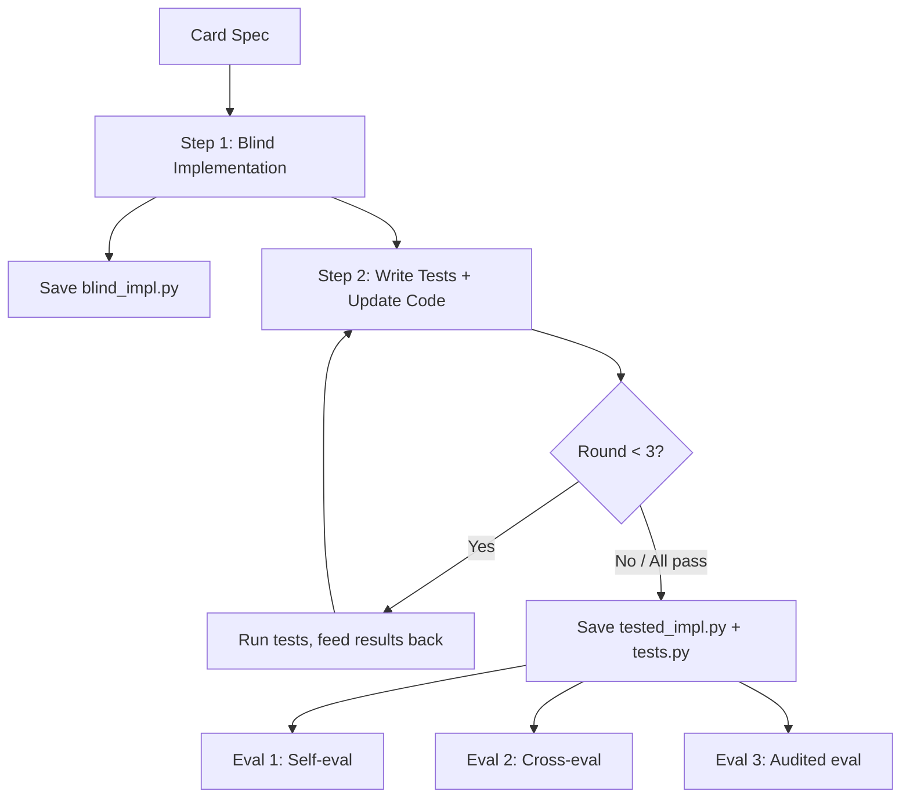

Status: SETTLED

Last updated: 2026-04-28

# Benchmark Runner

Orchestration harness for the end-to-end benchmark.

## Context

The runner feeds cards to agents, collects implementations and tests, runs evaluation, and records results. It enforces contamination controls and tracks cost metrics.

## Design

### Architecture



### Runner Configuration

```yaml
benchmark:
  name: "magicbench-v1-strixhaven"
  set_code: "SOS"
model:
  name: "claude-sonnet-4"
  provider: "anthropic"
  max_context: 200000
  temperature: 0.0
agent:
  tool: "opencode"
  max_test_rounds: 3
  timeout_per_card: 300
  disable_web_search: true
paths:
  benchmarks_dir: "./benchmarks/"  # Each set gets benchmarks/{set_code}/
  engine_docs: "./docs/engine_api.md"
  output_dir: "./benchmarks/sos/results/"
```

### Agent Context

Files provided to the agent:

- `card_spec.json` — Card data (name, mana cost, type line, oracle text)
- `engine_api.md` — Game engine API reference
- `base_classes.py` — Card base classes (read-only)
- `test_utils.md` — Test utilities documentation (Step 2 only)
- `template.py` — Skeleton with standardized class name and imports
- `rules_overview.md` — Brief MTG rules overview + lookup skill docs
- `foundations/` — Browsable codebase of Foundations card implementations (read-only, not bulk-loaded)
- **Rules lookup skill** — Tool to search MTG rules by rule number, keyword, or mechanic
Context limit: 200K tokens. Agent manages its own context budget.

Not provided (contamination controls): no target set implementations, no XMage Java source, no internet, no other agents' work.

### Cross-Evaluation Compatibility

Every card uses a standardized class name and module path from `template.py`:

```python
from magicbench.engine import *
from magicbench.cards.base import CardImpl

class StrixhavenProdigy(CardImpl):
    """Implementation of Strixhaven Prodigy."""
    ...
```

The runner swaps implementations by replacing the .py file. Tests import from `card_impl`, so any agent's code can be dropped in.

### Step 1: Blind Implementation Prompt

```javascript
You are implementing a Magic: The Gathering card for the MagicBench game engine.

Card: {card_name}
Mana Cost: {mana_cost}
Type: {type_line}
Rules Text: {oracle_text}

Implement this card by completing the class in template.py.
You have access to:
- engine_api.md (game engine API reference)
- base_classes.py (card base classes)
- rules_overview.md + rules lookup tool (search MTG rules by keyword/number)
- foundations/ (browse working card implementations as reference)

Produce a single Python file that implements this card.
Do not rename the class. Do not write tests. Do not modify any other files.
```

### Step 2: Test-Informed Implementation Prompt

```javascript
Now write a comprehensive test suite for your implementation of {card_name}.

Constraints:
- You MUST use the test_utils helpers (create_game, set_board_state, cast_spell, etc.)
  See test_utils.md for the full API.
- Maximum 30 tests per card. Focus on quality over quantity.
- Tests must import from card_impl (e.g. `from card_impl import {ClassName}`)

Test for:
- Basic functionality (correct stats, mana cost, card types)
- Core abilities working correctly
- Edge cases (no valid targets, empty board, etc.)
- Interaction with game rules (stack, priority, state-based actions)

You may also update your implementation if you discover issues.
You have up to 3 rounds to iterate on both tests and code.
```

### Evaluation Phase

1. **Self-eval**: Run blind_[impl.py](http://impl.py/) and tested_[impl.py](http://impl.py/) against agent's own [tests.py](http://tests.py/)
2. **Cross-eval**: Run all agents' implementations against all other agents' tests
3. **Audited eval**: Run all implementations against human-curated gold-standard tests
### Result Record

```json
{
    "card_id": "sos-042",
    "agent": "claude-sonnet-4",
    "complexity_tier": "medium",
    "implementation": {
        "blind_tokens": {"input": 8200, "output": 4250, "total": 12450},
        "blind_runtime_seconds": 45.2,
        "blind_peak_context": 52000,
        "tested_tokens": {"input": 18400, "output": 10400, "total": 28800},
        "tested_runtime_seconds": 120.5,
        "tested_peak_context": 98000,
        "test_iterations": 2,
        "rules_lookups": 3
    },
    "self_eval": {
        "blind": {"passed": 5, "failed": 3, "total": 8},
        "tested": {"passed": 8, "failed": 0, "total": 8}
    },
    "cross_eval": {"agent_b_tests": {"...": "..."}, "agent_c_tests": {"...": "..."}},
    "audited_eval": {
        "blind": {"passed": 6, "failed": 6, "total": 12},
        "tested": {"passed": 10, "failed": 2, "total": 12}
    }
}
```

### Contamination Controls

1. **No web access** — OpenCode `deny` permission on webfetch and network commands
2. **Clean working directory** — Fresh temp directory per card with only allowed files
3. **New set cards** — SOS released 2026-04-24; too new for LLM training data or XMage implementation
4. **No cross-card leakage** — Context reset between cards
### Error Handling

| Error | Handling |
| --- | --- |
| Agent timeout | Record "timeout"; count as all tests failed |
| Syntax/import error | Feed to correction round |
| Runtime error in tests | Record which tests errored; count as failures |
| No output | Record "no_output"; all tests failed |
| Wrong files modified | Discard changes; record "violation" |

### Output Artifacts

All set-specific artifacts live under `benchmarks/{set_code}/` so future sets get a clean directory:

```javascript
benchmarks/sos/
├── data/
│   ├── sos.json                  # Scryfall card data cache
│   ├── sos_classified.json       # Complexity tier classifications
│   ├── comprehensive_rules.txt   # Pinned MTG rules for this expansion
│   └── rules_overview.md         # Compact rules summary for agent context
├── cards/
│   ├── 001/
│   │   └── card_spec.json        # Per-card spec for agents
│   └── ...
├── prototype_cards.json          # Selected prototype cards + rationale
├── prototype_gaps.md             # Engine gap analysis
└── results/
    └── {run_name}/               # One folder per run (e.g. "claude-sonnet-4_2026-04-28T18-30")
        ├── config.yaml            # Copy of the run config
        ├── summary.json           # Aggregate stats for this run
        ├── cross_eval_matrix.json # Cross-eval results (if multi-agent)
        ├── leaderboard.md         # Scored leaderboard for this run
        └── cards/
            ├── sos-001/
            │   ├── blind_impl.py
            │   ├── tested_impl.py
            │   ├── tests.py
            │   ├── iterations/
            │   ├── result.json
            │   └── audited_tests.py  # Gold-standard tests (if audited)
            └── ...
```

Run name defaults to `{model_name}_{ISO-timestamp}` (e.g. `claude-sonnet-4_2026-04-28T18-30`). Each run is self-contained with its config and per-card artifacts. Cross-run aggregates (multi-model leaderboard, combined cross-eval matrix) live directly in `benchmarks/sos/results/`:

```javascript
benchmarks/sos/results/
├── leaderboard.md                 # Combined leaderboard across all runs
├── cross_eval_matrix.json         # Cross-eval across runs (if multi-model)
├── summary.json                   # Aggregate stats across all runs
├── claude-sonnet-4_2026-04-28T18-30/
│   ├── config.yaml
│   ├── summary.json               # Per-run stats
│   └── cards/ ...
├── gpt-5_2026-04-29T09-15/
│   ├── config.yaml
│   ├── summary.json
│   └── cards/ ...
└── ...
```

Set-agnostic files stay at top level: `docs/` (engine_[api.md](http://api.md/), test_[utils.md](http://utils.md/)), `benchmark/` (runner package code). Rules are pinned per set since comprehensive rules change per expansion.

### Cost Tracking

The runner tracks per-card and aggregate:

- **Token counts**: input, output, total (per step and cumulative)
- **Peak context**: maximum context window usage during session
- **Time spent**: wall-clock time per step and total
- **Rules lookups**: number of rules lookup skill invocations
## Decisions

- **200K token context limit**: Agent manages own budget; rules via lookup skill, not bulk-loaded. [SETTLED]
- **Rules as lookup skill**: Rules indexed by section/keyword; agent decides what to look up. [SETTLED]
- **Cost tracking enabled**: Token counts, peak context, and time tracked per card. [SETTLED]
- **foundations/ as browsable codebase**: Agent can list/read files, not expected to ingest everything. [SETTLED]
- **Standardized class names**: [template.py](http://template.py/) fixes class name and import path for cross-eval compatibility. [SETTLED]
