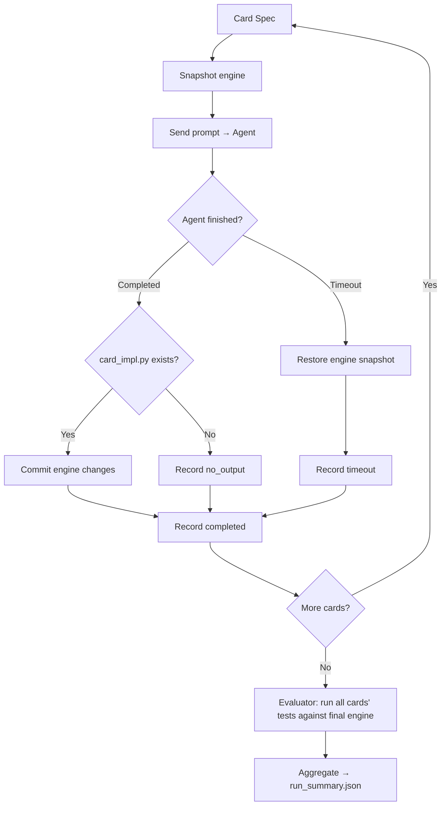

Status: SETTLED

Last updated: 2026-04-28

# Benchmark Runner

Orchestration harness for the end-to-end benchmark.

## Context

The runner feeds cards to agents, collects implementations and tests, runs evaluation, and records results. It enforces contamination controls and tracks cost metrics.

## Design

### Architecture



### Runner Configuration

```yaml
name: "SOS Benchmark Run"
set_code: "SOS"
model_name: "claude-sonnet-4-20250514"
model_provider: "anthropic"
max_context: 200000
temperature: 0.0
mode: "impl_test"                  # "blind" | "impl_test"
agent:
  adapter: "opencode"              # one of: opencode | claude_code | aider | pi
  timeout_per_card: 300
  disable_web_search: true
card_specs_dir: "benchmarks/sos/cards"
engine_docs_path: "docs/engine_api.md"
output_dir: "benchmarks/sos/results"
```

### Multi-Agent Support

The runner supports multiple agent adapters via a pluggable `AgentAdapter` base class. Each adapter translates the runner's prompts and workspace into the agent tool's native interface.

```python
class AgentAdapter(ABC):
    """Base class for agent tool adapters."""
    @abstractmethod
    def run(self, prompt: str, workspace: Path, timeout: int) -> AgentRunResult: ...
    @abstractmethod
    def get_session_log(self) -> str: ...
```

**Supported adapters (v1):**

| Adapter | Tool | Tool-calling | Notes |
| --- | --- | --- | --- |
| `opencode` | OpenCode | Required (OpenAI-compatible) | `opencode run [message]`; config via `opencode.json` |
| `claude_code` | Claude Code | Native | Anthropic's CLI agent; `claude -p [message]` |
| `aider` | Aider | Not required (text-based edits) | Best for models without tool-calling (e.g. MiniMax via llama.cpp) |
| `pi` | Pi ([pi.dev](http://pi.dev/)) | Required | General-purpose coding agent |

The adapter is selected by `agent.adapter` in config. Each adapter captures stdout/stderr and structures it into the postmortem log (see Per-Round Logging below).

### Workspace Model: Persistent Engine per Run

A single benchmark run processes cards **sequentially** with a **shared, writable engine** that accumulates the agent's modifications across cards. Each run starts from the same base engine, so different agents/models are comparable.

**Per-run engine lifecycle:**

1. Run starts → copy `engine/` to a persistent run-level engine directory (writable)
2. Card 1 workspace created → symlinks or copies the run engine into workspace
3. Agent implements card 1 → may modify engine files (e.g., add a new mechanic)
4. Card 1 completes → engine changes are **committed back** to the run-level engine
5. Card 2 workspace created → starts with the engine as modified by card 1
6. …repeat for all cards…
7. Run ends → final engine state saved as an artifact alongside results
**Why persistent**: Cards in the target set may require mechanics not in the base engine (e.g., Ward, Magecraft). The agent must extend the engine to implement them. A good agent writes **generic mechanics** that work for future cards — not one-off hacks. This measures architectural quality and forward thinking.

**Regression detection**: All evaluation happens after the full run completes. The evaluator runs all cards' tests against the final engine state. If a late card's engine change broke an early card, it shows up as a test failure for the early card — but is not attributed to a specific card. This tradeoff favors pipeline simplicity; a bisect tool can be added later if regression attribution is needed.

**Card ordering**: Cards are sorted by complexity tier (trivial → simple → medium → complex → expert) so the agent builds up engine capabilities gradually. Within a tier, cards are sorted by collector number for determinism.

### Agent Context

Files provided to the agent in each card's workspace:

- `card_spec.json` — Card data (name, mana cost, type line, oracle text)
- `engine_api.md` — Game engine API reference
- `engine/` — **Writable** copy of the game engine (persistent across cards within a run)
- `base_classes.py` — Card base classes (convenience copy from engine/)
- `test_utils.md` — Test utilities documentation (**impl_test mode only**)
- `test_utils.py` — Test utilities module (**impl_test mode only**)
- `template.py` — Skeleton with standardized class name and imports
- `rules_overview.md` — Brief MTG rules overview + best practices for grepping the full rules
- `comprehensive_rules.txt` — Full MTG comprehensive rules (available for grepping; agents manage their own context budget)
- `foundations/` — Browsable codebase of Foundations card implementations (read-only, not bulk-loaded)
Context limit: 200K tokens. Agent manages its own context budget.

Not provided (contamination controls): no target set implementations, no XMage Java source, no internet, no other agents' work.

**Engine modification rules**: The agent may add new files to `engine/` or modify existing ones. The prompt instructs the agent that all previous cards' tests will be re-run after each card, so engine changes must not break existing functionality.

### Cross-Evaluation Compatibility

Every card uses a standardized class name and module path from `template.py`:

```python
from silverquillm.engine import *
from silverquillm.cards.base import CardImpl

class StrixhavenProdigy(CardImpl):
    """Implementation of Strixhaven Prodigy."""
    ...
```

The runner swaps implementations by replacing the .py file. Tests import from `card_impl`, so any agent's code can be dropped in.

### Mode 1: Blind Implementation Prompt

Used when `mode: "blind"`. Single agent invocation per card.

```javascript
You are implementing a Magic: The Gathering card for the SilverquiLLM-bench game engine.

Card: {card_name}
Mana Cost: {mana_cost}
Type: {type_line}
Rules Text: {oracle_text}

Implement this card by completing the class in template.py.
You have access to:
- engine_api.md (game engine API reference)
- engine/ (game engine source — you may extend it if this card needs mechanics not yet supported)
- base_classes.py (card base classes)
- rules_overview.md (brief rules overview + grep best practices)
- comprehensive_rules.txt (full rules, available for grepping)
- foundations/ (browse working card implementations as reference)

Write your implementation to `card_impl.py`.
If you need to add or modify engine files, do so — but all previous cards' tests
will be re-run, so your engine changes must not break existing functionality.
Do not rename the class. Do not write tests.
```

### Mode 2: Implementation + Test Prompt

Used when `mode: "impl_test"`. Single agent invocation per card. The agent self-manages iteration — the harness does not orchestrate rounds.

```javascript
You are implementing a Magic: The Gathering card for the SilverquiLLM-bench game engine.

Card: {card_name}
Mana Cost: {mana_cost}
Type: {type_line}
Rules Text: {oracle_text}

Implement this card and write a comprehensive test suite.
You have access to:
- engine_api.md (game engine API reference)
- engine/ (game engine source — you may extend it if this card needs mechanics not yet supported)
- base_classes.py (card base classes)
- test_utils.md (test utilities API reference)
- test_utils.py (test utilities module)
- rules_overview.md (brief rules overview + grep best practices)
- comprehensive_rules.txt (full rules, available for grepping)
- foundations/ (browse working card implementations as reference)

Constraints:
- You MUST use the test_utils helpers (create_game, set_board_state, cast_spell, etc.)
- Maximum 30 tests per card. Focus on quality over quantity.
- Tests must import from card_impl (e.g. `from card_impl import {ClassName}`)
- You can run tests yourself to iterate on both code and tests.

Write your implementation to `card_impl.py`.
Write your tests to `tests.py`.
If you need to add or modify engine files, do so — but all previous cards' tests
will be re-run, so your engine changes must not break existing functionality.
Do not rename the class.
```

### Evaluation Phase

1. **Self-eval** (impl_test mode only): Run `card_impl.py` against agent's own `tests.py`
2. **Cross-eval**: Run all agents' implementations against all other agents' tests
3. **Audited eval**: Run all implementations against human-curated gold-standard tests (from `tests/audited/{set_code}/`, never in agent workspace)
### Result Record

```json
{
    "card_id": "sos-042",
    "mode": "impl_test",
    "model_name": "claude-sonnet-4",
    "adapter": "opencode",
    "complexity_tier": "medium",
    "status": "completed",
    "implementation": {
        "tokens": {"input": 18400, "output": 10400, "total": 28800},
        "runtime_ms": 120500,
        "peak_context": 98000
    },
    "self_eval": {
        "passed": 8, "failed": 0, "total": 8
    },
    "audited_eval": {
        "passed": 10, "failed": 2, "total": 12
    },
    "engine_diff_summary": "Added ward.py, modified combat.py"
}
```

### Contamination Controls

1. **No web access** — OpenCode `deny` permission on webfetch and network commands
2. **Fresh workspace per card** — New temp directory per card, but engine state carries forward within a run
3. **New set cards** — SOS released 2026-04-24; too new for LLM training data or XMage implementation
4. **No cross-agent leakage** — Each agent/model gets its own run with a fresh engine copy. Agents never see other agents' engine modifications or implementations
5. **Engine regression detection** — After the full run, all cards' tests are run against the final engine state. Engine modifications that break earlier cards are detected via test failures
### Per-Card Logging & Postmortem

Since agent export tools (e.g. `opencode export`) are unreliable, the runner captures structured logs per card. These logs are the primary source for debugging and postmortem analysis.

**What is captured per card:**

- Agent stdout/stderr (full text, streamed in real-time)
- Agent thinking/reasoning traces (if the model emits them)
- Files written by the agent (detected via filesystem check)
- Evaluation results (self-eval, audited eval, regression check)
- Timing: agent start, agent finish, eval finish
- Token usage (if reported by the agent tool)
**Postmortem log file** (`postmortem.jsonl`): One JSON line per event, stored per card:

```json
{"ts": "2026-05-07T10:01:23Z", "event": "agent_start", "prompt_hash": "abc123"}
{"ts": "2026-05-07T10:02:45Z", "event": "agent_output", "stream": "stdout", "text": "Thinking: I need to implement..."}
{"ts": "2026-05-07T10:03:10Z", "event": "agent_finish", "exit_code": 0, "runtime_ms": 107200}
{"ts": "2026-05-07T10:03:11Z", "event": "file_written", "path": "card_impl.py", "size_bytes": 2400}
{"ts": "2026-05-07T10:03:15Z", "event": "eval_result", "eval_type": "self", "passed": 5, "failed": 3}
{"ts": "2026-05-07T10:03:20Z", "event": "eval_result", "eval_type": "audited", "passed": 10, "failed": 2}
{"ts": "2026-05-07T10:03:25Z", "event": "regression_check", "cards_checked": 3, "failures": 0}
```

**Artifacts per card** (updated layout):

```javascript
cards/{card_id}/
├── card_impl.py              # The agent's implementation
├── tests.py                  # Agent's tests (impl_test mode only)
├── result.json
├── postmortem.jsonl          # Full structured log for debugging
└── agent_thoughts.md         # Extracted reasoning traces (human-readable)
```

The `agent_thoughts.md` file is auto-generated from `postmortem.jsonl` by extracting reasoning/thinking blocks from agent output. This gives a human-readable narrative of the agent's approach for each card.

### Agent Setup Questioning

Agents may encounter issues with the workspace setup (missing files, unclear engine API, card spec ambiguities). Rather than silently failing or hallucinating, agents can emit structured **setup questions** via a `setup_questions.json` file in the workspace.

```json
[
  {
    "type": "missing_file",
    "description": "test_utils.py referenced in prompt but not found in workspace",
    "severity": "blocking"
  },
  {
    "type": "ambiguous_spec",
    "description": "Card rules text says 'counter target spell' but engine_api.md has no counter_spell() method",
    "severity": "warning"
  },
  {
    "type": "engine_gap",
    "description": "No API for 'exile from graveyard' — only exile() from battlefield exists",
    "severity": "blocking"
  }
]
```

**Schema fields:**

- `type`: one of `missing_file`, `ambiguous_spec`, `engine_gap`, `mechanic_not_found`, `import_error`, `other`
- `description`: free-text explanation of the issue
- `severity`: `blocking` (cannot proceed) or `warning` (proceeded with best guess)
The runner checks for `setup_questions.json` after each agent run. Blocking questions are logged and the card is marked `status: "setup_error"`. Warning questions are logged in the postmortem but don't halt execution. Aggregated questions across all cards surface systemic issues (e.g. a missing engine method needed by many cards).

### Error Handling

| Error | Handling |
| --- | --- |
| Agent timeout | Record "timeout"; zero all scores; roll back engine to pre-card snapshot |
| Syntax/import error | Agent handles during its session; if still broken at eval time, counted as test failures |
| Runtime error in tests | Record which tests errored; count as failures |
| No output | Record "no_output"; all tests failed |
| Wrong files modified | Discard changes; record "violation" |

### Output Artifacts

All set-specific artifacts live under `benchmarks/{set_code}/` so future sets get a clean directory:

```javascript
benchmarks/sos/
├── data/
│   ├── sos.json                  # Scryfall card data cache
│   ├── sos_classified.json       # Complexity tier classifications
│   ├── comprehensive_rules.txt   # Pinned MTG rules for this expansion
│   └── rules_overview.md         # Compact rules summary for agent context
├── cards/
│   ├── 001/
│   │   └── card_spec.json        # Per-card spec for agents
│   └── ...
├── prototype_cards.json          # Selected prototype cards + rationale
├── prototype_gaps.md             # Engine gap analysis
└── results/
    └── {run_name}/               # One folder per run (e.g. "claude-sonnet-4_2026-04-28T18-30")
        ├── config.yaml            # Copy of the run config
        ├── summary.json           # Aggregate stats for this run
        ├── cross_eval_matrix.json # Cross-eval results (if multi-agent)
        ├── leaderboard.md         # Scored leaderboard for this run
        └── cards/
            ├── sos-001/
            │   ├── card_impl.py
            │   ├── tests.py          # impl_test mode only
            │   ├── result.json
            │   ├── postmortem.jsonl
            │   └── agent_thoughts.md
            └── ...
```

Run name defaults to `{model_name}_{ISO-timestamp}` (e.g. `claude-sonnet-4_2026-04-28T18-30`). Each run is self-contained with its config and per-card artifacts. Cross-run aggregates (multi-model leaderboard, combined cross-eval matrix) live directly in `benchmarks/sos/results/`:

```javascript
benchmarks/sos/results/
├── leaderboard.md                 # Combined leaderboard across all runs
├── cross_eval_matrix.json         # Cross-eval across runs (if multi-model)
├── summary.json                   # Aggregate stats across all runs
├── claude-sonnet-4_2026-04-28T18-30/
│   ├── config.yaml
│   ├── summary.json               # Per-run stats
│   └── cards/ ...
├── gpt-5_2026-04-29T09-15/
│   ├── config.yaml
│   ├── summary.json
│   └── cards/ ...
└── ...
```

Set-agnostic files stay at top level: `docs/` (engine_[api.md](http://api.md/), test_[utils.md](http://utils.md/)), `benchmark/` (runner package code). Rules are pinned per set since comprehensive rules change per expansion.

### Cost Tracking

The runner tracks per-card and aggregate:

- **Token counts**: input, output, total (per step and cumulative)
- **Peak context**: maximum context window usage during session
- **Time spent**: wall-clock time per step and total (stored as milliseconds internally, displayed as seconds in output)
## Decisions

- **200K token context limit**: Agent manages own budget; comprehensive rules available for grepping but expensive to bulk-load. [SETTLED]
- **Rules as greppable file**: Comprehensive rules available in workspace as a file; agent greps for relevant sections. Best-practices doc provided in `rules_overview.md`. Replaces tool-based lookup for adapter fairness. [UPDATED]
- **Cost tracking enabled**: Token counts, peak context, and time tracked per card. [SETTLED]
- **foundations/ as browsable codebase**: Agent can list/read files, not expected to ingest everything. [SETTLED]
- **Standardized class names**: [template.py](http://template.py/) fixes class name and import path for cross-eval compatibility. [SETTLED]
- **Multi-agent via adapter pattern**: Pluggable `AgentAdapter` base class; v1 supports OpenCode, Claude Code, Aider, Pi. Config selects adapter. [SETTLED]
- **Per-round postmortem logging**: `postmortem.jsonl` captures agent output, file diffs, test results, and reasoning traces per round. `agent_thoughts.md` extracted for human review. [SETTLED]
- **Agent setup questioning**: Agents emit `setup_questions.json` to flag missing files, engine gaps, or ambiguous specs instead of silently failing. [SETTLED]
- **Harness does not run pytest during implementation rounds**: The agent runs its own tests via its shell during iteration. The harness's only test-running responsibility is the evaluator (`evaluator.run_tests()`), used for self-eval, cross-eval, and audited eval. Removes `_run_pytest` from `agent_session.py`. [SETTLED, 2026-05-11 grill]
- **Filesystem checks as source of truth for agent output**: Whether the agent produced `card_impl.py` or `tests.py` is determined by checking the filesystem after the agent finishes — not by exit codes or stdout parsing. Exit codes, stdout, and thinking traces are captured as diagnostics only. [SETTLED, 2026-05-11 grill]
- **Engine is cumulative, no per-card restore**: The evaluator runs against the persistent engine state as it exists after each card completes. No engine snapshots or patches are restored per card. `engine_diff.patch` remains a human-readable artifact only. [SETTLED, 2026-05-11 grill]
- **All evaluation is post-run**: No per-card evaluation or regression checks during the run. After all cards are processed, the evaluator runs all tests against the final engine state. Regressions are detected by comparing test results but not attributed to a specific card. [SETTLED, 2026-05-11 grill]
- **Automatic run summary aggregation**: `run_summary.json` is generated automatically at the end of every run by a pure function that reads per-card `result.json` files. Idempotent and deterministic. [SETTLED, 2026-05-11 grill]
- **Smoke-test coverage**: End-to-end harness self-test with mock adapter covering workspace setup, file detection, evaluator round-trip, regression timeline, aggregation, and error cases. Fully deterministic, zero LLM calls. [SETTLED, 2026-05-11 grill]
- **Agent self-manages iteration**: The harness does not orchestrate test rounds. `max_test_rounds` removed from config. The agent runs tests and iterates during Step 2 at its own discretion. The harness sends the prompt, waits for completion or timeout, and checks the filesystem. [SETTLED, 2026-05-11 grill]
- **Single prompt per card, mode-dependent**: Each mode sends one prompt per card with one `timeout_per_card`. Blind vs. test-informed comparison is done across separate runs (Mode 1 vs Mode 2), not within a single run. [SETTLED, 2026-05-11 grill]
- **No iterations/ artifact directory**: Per-card artifacts are flat (7 files). Agent iteration details are captured in `postmortem.jsonl` and `agent_thoughts.md`, not structured directories. [SETTLED, 2026-05-11 grill]
- **Timeout zeroes all scores**: On timeout, the card gets `status: "timeout"` and all eval scores are zero. No partial scoring from files that may have been written before timeout. [SETTLED, 2026-05-11 grill]
- **Engine rollback on timeout**: Before each card, the harness snapshots the engine directory. On timeout, the engine is restored to the pre-card snapshot to prevent corrupted state from poisoning subsequent cards. [SETTLED, 2026-05-11 grill]
- **Two benchmark modes**: `mode: "blind"` (impl only, eval via external tests) and `mode: "impl_test"` (impl + tests, agent self-iterates). Config selects mode. No blind/tested split within a single run — compare modes across runs instead. [SETTLED, 2026-05-11 grill]
- **CardStrategy pattern for per-card orchestration**: Outer runner loop is mode-agnostic. `BlindStrategy` and `ImplTestStrategy` encapsulate per-card prompt/file logic. Multi-model orchestration is a future strategy, not v1. [SETTLED, 2026-05-11 grill]
- **Unified ****`card_impl.py`**** naming**: Both modes produce `card_impl.py`. No `blind_impl.py` / `tested_impl.py` distinction. [SETTLED, 2026-05-11 grill]
- **Audited tests are evaluation-only**: Never in the agent's workspace or per-run result directories. Referenced by the evaluator at eval time from `tests/audited/{set_code}/`. This is a contamination control. [SETTLED, 2026-05-11 grill]
- **result.json v2 schema**: Single `implementation` block, `mode` field, flat `self_eval` (null for blind mode), `status` enum (`completed | timeout | no_output`). No per-card regression data — regressions detected post-run at the `run_summary.json` level. Cross-eval stays at run level. [SETTLED, 2026-05-11 grill]
