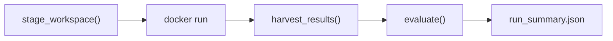

Status: DRAFT (rewritten for container architecture)

Last updated: 2026-05-13

# Benchmark Runner

Orchestration harness for the end-to-end benchmark. The runner stages a workspace, launches an agent container, harvests results, and runs evaluation. It has no knowledge of agent internals.

## Context

The runner is the host-side orchestrator. It prepares everything the agent needs, launches a Docker container, waits for it to finish, and evaluates the results. All agent-internal orchestration (prompt handling, mode selection, iteration strategy) lives inside the container's entrypoint. See [AGENT-CONTAINERS.md](https://www.notion.so/07182a53c93641b7831fe9d240403de3) for the container architecture.

## Architecture



## Runner CLI

The Docker image *is* the full agent configuration — it bakes in the agent CLI, mode (blind/tested), strategy, model, and prompt. The runner's only job is to stage the workspace, launch the image, and harvest results.

```bash
python -m silverquillm run \
  --image silverquillm-opencode-tested:latest \
  --cards-dir ./cards \
  --engine-dir ./engine \
  --timeout 7200
```

| Argument | Description |
| --- | --- |
| `--image` | Docker image to run (encodes agent + mode + strategy) |
| `--cards-dir` | Path to cards directory (contains `fdn/` and `sos/` subdirectories) |
| `--engine-dir` | Path to engine source |
| `--timeout` | Total run timeout in seconds |

## Workspace Staging

The runner builds a workspace directory that the container sees as `/workspace/`. See [AGENT-CONTAINERS.md](https://www.notion.so/07182a53c93641b7831fe9d240403de3) for the full workspace layout.

Staging steps:

1. Copy engine source to `workspace/engine/`
2. Copy rulebook to `workspace/rulebook.md`
3. Copy reference docs (`engine_api.md`, `base_classes.py`, `test_utils.md`)
4. Copy FDN cards (with filled implementations) to `workspace/cards/fdn/`
5. Copy SOS cards (with empty templates) to `workspace/cards/sos/`
6. Write `workspace/prompt.md`
FDN and SOS card directories share the same structure (`card_spec.json` + `card_impl.py`), keeping the workspace consistent. FDN implementations are filled in as examples; SOS implementations are empty templates. No test files are included for either set — agents devise their own testing approach.

## Container Launch

The runner calls `docker run` with the workspace and output directories mounted as volumes, and API credentials passed as environment variables. The call blocks until the container exits.

Timeout is enforced at two levels:

1. **Docker level** — `--stop-timeout N` sends `SIGTERM` then `SIGKILL`
2. **Subprocess level** — Python's `subprocess.run(timeout=N+60)` as a backup
On timeout, the runner still harvests partial results — whatever cards the agent completed before being killed are evaluated normally.

## Result Harvesting

After the container exits, the runner walks the workspace and collects:

- `workspace/cards/sos/*/card_impl.py` — Agent's card implementations
- `workspace/cards/sos/*/tests.py` — Agent's test suites (tested mode)
- `workspace/engine_work/` — Agent's modified engine (diffed against original)
- `output/progress.jsonl` — Per-card progress log
- `output/stdout.log` — Agent stdout
- `output/stderr.log` — Agent stderr
A card is considered "implemented" if its `card_impl.py` differs from the original template. Cards with unmodified templates are recorded as `no_output`.

## Evaluation Phase

All evaluation is post-run — no evaluation happens during the agent's session. The evaluator runs audited tests only. Agent-written tests are harvested as artifacts but not used for v1 scoring.

Three evaluation dimensions:

1. **SOS Card Correctness** — Run `tests/audited/sos/*/tests.py` against each agent's `card_impl.py` using the agent's `engine_work/`
2. **FDN Card Regression** — Run `tests/audited/fdn/*/tests.py` against pre-filled FDN `card_impl.py` using the agent's `engine_work/`
3. **Engine Regression** — Run `tests/engine/` against the agent's `engine_work/`
The evaluator runs outside the container on the host. For each SOS card:

1. Copy `card_impl.py` to a temp directory
2. Apply the agent's engine diff to a clean engine copy
3. Set `PYTHONPATH` to include the modified engine
4. Run pytest and capture results
### Implementation Compatibility

Every card uses a standardized class name and module path from `template.py`. Tests import from `card_impl`, so any agent's implementation can be swapped in:

```python
from card_impl import StrixhavenProdigy
```

## Result Record

Per-card result after evaluation:

```json
{
    "card_id": "042",
    "card_name": "Ajani's Response",
    "status": "completed",
    "complexity_tier": "medium",
    "audited_eval": {
        "passed": 10, "failed": 2, "total": 12
    },
    "engine_modified": true
}
```

Status values: `completed` (card_[impl.py](http://impl.py/) differs from template), `no_output` (template unchanged), `timeout` (run timed out before this card was reached).

## Output Artifacts

```javascript
results/{run_name}/
├── run_summary.json            # Aggregate stats
├── engine_diff.patch           # Full engine diff (agent vs original)
├── progress.jsonl              # Copy of container progress log
├── stdout.log                  # Copy of container stdout
├── stderr.log                  # Copy of container stderr
└── cards/
    ├── 001/
    │   ├── card_impl.py        # Agent's implementation
    │   ├── tests.py            # Agent's tests (tested mode only)
    │   └── result.json         # Per-card eval results
    ├── 002/
    │   └── ...
    └── ...
```

Run name defaults to `{image_name}_{ISO-timestamp}` (e.g. `opencode_2026-05-13T01-30`). Each run is self-contained. Cross-run aggregates (multi-model leaderboard, combined cross-eval) live at the results root:

```javascript
results/
├── leaderboard.md
├── opencode-tested_2026-05-13T01-30/
│   └── ...
├── opencode-blind_2026-05-13T03-45/
│   └── ...
├── claude-code-tested_2026-05-14T09-15/
│   └── ...
└── ...
```

## Contamination Controls

1. **Container isolation** — Agent runs in a Docker container with only curated files mounted. Audited test suites, harness source, and benchmark results do not exist in the container.
2. **New set cards** — SOS released 2026-04-24; too new for LLM training data.
3. **No cross-agent leakage** — Each run gets a fresh container with a clean workspace. Agents never see other agents' work.
4. **FDN as examples, not contamination** — FDN implementations are intentionally provided as reference examples. SOS implementations (the benchmark target) are empty templates.
See [AGENT-CONTAINERS.md](https://www.notion.so/07182a53c93641b7831fe9d240403de3) → Isolation Guarantees for the full threat model.

## Error Handling

| Scenario | Handling |
| --- | --- |
| Container timeout | Harvest partial results; unfinished cards recorded as `timeout` |
| Agent crash (non-zero exit) | Harvest whatever was written; record exit code |
| No output for a card | Template unchanged → `no_output`; scored as zero |
| Engine modifications break tests | Detected during post-run evaluation; reported in results |
| Container won't start | Runner reports launch failure; no results |

## Cost Tracking

The runner tracks per-run metrics (not per-card, since the agent manages its own workflow):

- **Total tokens**: input, output (if reported by agent via progress log)
- **Wall-clock time**: total run duration
- **Per-card estimates**: approximated from `progress.jsonl` timestamps if available
## Decisions

- **Docker image is the full config**: No `config.yaml`, no `MODE`/`STRATEGY` env vars. The image bakes in agent CLI, mode, strategy, model selection, and prompt. Runner only passes workspace, output dir, timeout, and API keys. [UPDATED]
- **Single prompt for whole set**: One `prompt.md` covers the entire SOS card set. Mode-specific instructions appended by the entrypoint. Replaces per-card prompt rendering. [SETTLED]
- **FDN cards as in-context examples**: Completed FDN implementations in the workspace serve as examples. No test files included — agents devise their own testing approach. [SETTLED]
- **All evaluation is post-run**: No evaluation during the agent's session. After the container exits, the evaluator runs all tests against harvested implementations. [SETTLED]
- **Partial results on timeout**: On timeout, the runner harvests whatever cards the agent completed. Unfinished cards scored as zero, but completed cards are evaluated normally. [SETTLED]
- **Filesystem checks as source of truth**: Whether the agent produced `card_impl.py` is determined by comparing against the original template — not by exit codes or stdout parsing. [SETTLED]
- **Unified ****`card_impl.py`**** naming**: Both blind and tested modes produce `card_impl.py`. Separate runs compare modes. [SETTLED]
- **Audited tests are evaluation-only**: Never in the agent's workspace. Referenced by the evaluator from `tests/audited/{set_code}/`. [SETTLED]
- **Agent self-manages iteration**: The agent decides when to run tests, when to iterate, and when to move on. The runner does not orchestrate test rounds. [SETTLED]
- **Automatic run summary**: `run_summary.json` generated after evaluation by reading per-card `result.json` files. Idempotent and deterministic. [SETTLED]
- **Two benchmark modes**: Blind (impl only) and tested (impl + tests). Baked into separate Docker images. Compare modes across separate runs. [UPDATED]
