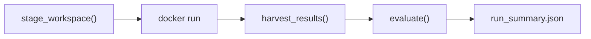

Status: DRAFT (rewritten for container architecture)

Last updated: 2026-05-13

# Benchmark Runner

Orchestration harness for the end-to-end benchmark. The runner stages a workspace, launches an agent container, harvests results, and runs evaluation. It has no knowledge of agent internals.

## Context

The runner is the host-side orchestrator. It prepares everything the agent needs, launches a Docker container, waits for it to finish, and evaluates the results. All agent-internal orchestration (prompt handling, mode selection, iteration strategy) lives inside the container's entrypoint. See [AGENT-CONTAINERS.md](https://www.notion.so/07182a53c93641b7831fe9d240403de3) for the container architecture.

Detailed contracts are split into focused specs:

- [WORKSPACE-CONTRACT.md](https://www.notion.so/ad4d407fda954387adf7eb4ba8674371) defines the Workspace layout, Run Manifest, card directory invariant, and in-place engine editing model.
- [RUN-ARTIFACTS-AND-TELEMETRY.md](https://www.notion.so/1ffe911b65564fa6860b2a91dcc94fb5) defines `workspace_final/`, snapshot fallback, telemetry, Docker logs, filtered runs, and smoke runs.
## Architecture



## Runner CLI

The Docker image *is* the full agent configuration — it bakes in the agent CLI, mode (blind/tested), strategy, model, and prompt. The runner's only job is to stage the workspace, launch the image, and harvest results.

```bash
python -m silverquillm run \
  --image silverquillm-pi-blind:latest \
  --cards-dir ./cards \
  --engine-dir ./engine \
  --timeout 7200
```

| Argument | Description |
| --- | --- |
| `--image` | Docker image to run (encodes agent + mode + strategy) |
| `--cards-dir` | Path to cards directory (contains `fdn/` and `sos/` subdirectories) |
| `--engine-dir` | Path to engine source |
| `--timeout` | Total run timeout in seconds |

## Workspace Staging

The runner builds a workspace directory that the container sees as `/workspace/`. See [AGENT-CONTAINERS.md](https://www.notion.so/07182a53c93641b7831fe9d240403de3) for the full workspace layout.

Staging steps:

1. Copy engine source to `workspace/engine/`
2. Copy rulebook to `workspace/rulebook.md`
3. Copy reference docs (`engine_api.md`, `base_classes.py`, `test_utils.md`)
4. Copy FDN cards (with filled implementations) to `workspace/cards/fdn/`
5. Copy SOS cards (with empty templates) to `workspace/cards/sos/`
6. Write `workspace/prompt.md`
7. Immediately before container launch, write `workspace/run_manifest.json` with `timeout_seconds` and `deadline_utc`
FDN and SOS card directories share the same structure (`card_spec.json` + `card_impl.py`), keeping the workspace consistent. FDN implementations are filled in as examples; SOS implementations are empty templates. No test files are included for either set — agents devise their own testing approach.

## Container Launch

The runner calls `docker run` with the workspace and output directories mounted as volumes, and API credentials passed as environment variables. The call blocks until the container exits.

Timeout is enforced at two levels:

1. **Runner hard timeout** — The runner computes `deadline_utc` immediately before `docker run`, writes `/workspace/run_manifest.json`, starts the container, and enforces `timeout_seconds` from that launch point.
2. **Docker shutdown grace period** — On timeout, the runner explicitly calls `docker stop -t 10 <container_name>`. Docker sends `SIGTERM`, waits 10 seconds, then sends `SIGKILL` if needed.
3. **Container advisory timeout** — The container may read `/workspace/run_manifest.json` for pacing or graceful wrap-up, but benchmark correctness does not depend on it.
On timeout, the runner still harvests partial results and the latest usable Output Snapshot. Completed cards are evaluated normally. Partial cards may be evaluated if importable but retain `partial` status.

## Result Harvesting

After the container exits, the runner selects the official evaluation Workspace and materializes it at `results/{run_name}/workspace_final/`.

The official evaluation Workspace is either:

- the final harvested Workspace, if its engine is viable, or
- the latest viable whole-Workspace snapshot selected by snapshot fallback.
Derived convenience artifacts may also be written, but evaluation reads from `workspace_final/`, not from legacy per-card copies.

The runner also collects telemetry and debugging artifacts:

- `docker_stdout.log` — host-captured Docker stdout
- `docker_stderr.log` — host-captured Docker stderr
- optional `/output/progress.jsonl`
- optional `/output/system.log`
- optional `/output/agent_stdout.log`
- optional `/output/agent_stderr.log`
- optional `/output/exit_code`
`/output/` is an observability channel only. It pipes agent and process output out of the container for extra telemetry and debugging. It is not part of the official evaluation state.

The Progress Log is recommended but not required. Entrypoints and agents may write `progress.jsonl` for live monitoring, but the runner must tolerate missing or malformed progress events.

During container execution, the runner captures periodic Output Snapshots, approximately once per minute. A snapshot records the current Workspace state only. Snapshots provide concrete progress measurement and allow recovery from final Workspace corruption, including scrambled engine code after timeout or interruption.

A card is considered "implemented" if its `card_impl.py` differs from the original template. Cards with unmodified templates are recorded as `no_output`.

A card has output if its `card_impl.py` differs from the original template. Progress events may refine changed output into `completed` or `partial`, but an unchanged template never counts as completed.

## Evaluation Phase

All evaluation is post-run — no evaluation happens during the agent's session. The evaluator runs audited tests only. Agent-written tests are harvested as artifacts but not used for v1 scoring.

Three evaluation dimensions:

1. **SOS Card Correctness** — Run `tests/audited/sos/*/tests.py` against each agent's `card_impl.py` using the harvested agent engine
2. **FDN Card Regression** — Run `tests/audited/fdn/*/tests.py` against pre-filled FDN `card_impl.py` using the harvested agent engine
3. **Engine Regression** — Run `tests/engine/` against the harvested agent engine
The evaluator runs outside the container on the host. For each SOS card:

1. Copy `card_impl.py` to a temp directory
2. Use the harvested agent engine, or a snapshot fallback engine if final engine state is invalid
3. Set `PYTHONPATH` to include the modified engine
4. Run pytest and capture results
### Snapshot Fallback

Output Snapshots are host-side Git commits of the Workspace. The `.git` directory is not mounted into the container.

If the final harvested Workspace has corrupted engine code, the runner may walk backward through snapshot commits until audited engine tests pass. The selected snapshot becomes the official harvested Workspace for evaluation. This fallback is narrow: it is for recovering from broken or scrambled final engine state, not for choosing a higher-scoring card implementation.

Snapshot fallback is whole-Workspace fallback, not engine-only fallback. If the runner selects a snapshot commit, evaluation uses that snapshot's `engine/`, `cards/sos/*/card_impl.py`, and `cards/sos/*/tests.py` together. The runner must not combine a final card implementation with an earlier engine snapshot, because that creates an artificial state the agent never produced.

Snapshot selection uses Engine Regression only (`tests/engine/`) as the viability gate. The runner does not require FDN Card Regression or SOS Card Correctness to pass before selecting a fallback snapshot, because that would turn recovery into score-shopping. FDN and SOS failures are evaluated normally after the coherent Workspace is selected.

When snapshot fallback is used, `run_summary.json` records:

```json
{
  "used_snapshot_fallback": true,
  "snapshot_commit": "abc123",
  "snapshot_utc": "2026-05-13T21:44:00Z",
  "fallback_scope": "entire_workspace",
  "fallback_reason": "final engine failed audited engine tests"
}
```

After each snapshot, the runner emits progress telemetry summarizing modified SOS cards, for example: newly modified card directories, total changed implementations, and changed test files.

If no snapshot passes Engine Regression, the run is marked `no_viable_output_produced`. This represents the edge case where the agent broke the engine before the first viable snapshot. The runner does not evaluate SOS or FDN card correctness for that run.

### Implementation Compatibility

Every card uses a standardized class name and module path from `template.py`. Tests import from `card_impl`, so any agent's implementation can be swapped in:

```python
from card_impl import StrixhavenProdigy
```

## Result Record

Per-card result after evaluation:

```json
{
    "card_id": "042",
    "card_name": "Ajani's Response",
    "status": "completed",
    "complexity_tier": "medium",
    "audited_eval": {
        "passed": 10, "failed": 2, "total": 12
    },
    "engine_modified": true
}
```

Status values:

- `completed` — `card_impl.py` differs from template and `progress.jsonl` contains `card_completed` for the card, or the run ended cleanly and the implementation is changed.
- `partial` — `card_impl.py` differs from template but the run timed out before a completion signal. Partial cards may still be evaluated if importable.
- `no_output` — template unchanged in a non-timeout run.
- `timeout_no_output` — template unchanged when the run timed out.
## Output Artifacts

```javascript
results/{run_name}/
├── workspace_final/            # Canonical full Workspace used for evaluation
├── snapshots/                  # Host-side Git snapshot repo for Workspace commits
├── snapshot_telemetry.jsonl    # Snapshot progress telemetry
├── docker_stdout.log           # Host-captured Docker stdout
├── docker_stderr.log           # Host-captured Docker stderr
├── engine_diff.patch           # Engine diff from workspace_final/engine vs baseline
├── run_manifest.json           # Copy of workspace_final/run_manifest.json
├── run_summary.json            # Aggregate stats and run metadata
├── progress.jsonl              # Optional copy from /output/, if present
└── cards/                      # Optional derived convenience artifacts only
    └── 001/
        ├── card_impl.py
        ├── tests.py
        └── result.json
```

Run name defaults to `{image_name}_{ISO-timestamp}` (e.g. `pi-blind_2026-05-13T01-30`). Each run is self-contained. Cross-run aggregates (multi-model leaderboard, combined cross-eval) live at the results root:

```javascript
results/
├── leaderboard.md
├── pi-blind_2026-05-13T01-30/
│   └── ...
├── pi-tested_2026-05-13T03-45/
│   └── ...
├── opencode-tested_2026-05-14T09-15/
│   └── ...
└── ...
```

## Contamination Controls

1. **Container isolation** — Agent runs in a Docker container with only curated files mounted. Audited test suites, harness source, and benchmark results do not exist in the container.
2. **New set cards** — SOS released 2026-04-24; too new for LLM training data.
3. **No cross-agent leakage** — Each run gets a fresh container with a clean workspace. Agents never see other agents' work.
4. **FDN as examples, not contamination** — FDN implementations are intentionally provided as reference examples. SOS implementations (the benchmark target) are empty templates.
See [AGENT-CONTAINERS.md](https://www.notion.so/07182a53c93641b7831fe9d240403de3) → Isolation Guarantees for the full threat model.

## Error Handling

| Scenario | Handling |
| --- | --- |
| Container timeout | Stop the container explicitly, harvest partial results, and use snapshot fallback if final engine state is corrupted; changed unfinished cards recorded as `partial`, unchanged cards as `timeout_no_output` |
| Agent crash (non-zero exit) | Harvest whatever was written; record exit code |
| No output for a card | Template unchanged → `no_output`; scored as zero |
| Engine modifications break tests | Detected during post-run evaluation; reported in results |
| Container won't start | Runner reports launch failure; no results |

## Cost Tracking

The runner tracks per-run metrics (not per-card, since the agent manages its own workflow):

- **Total tokens**: input, output (if reported by agent via progress log)
- **Wall-clock time**: total run duration
- **Per-card estimates**: approximated from `progress.jsonl` timestamps if available
## Decisions

- **Docker image is the full config**: No `config.yaml`, no `MODE`/`STRATEGY` env vars. The image bakes in agent CLI, mode, strategy, model selection, and prompt. Runner only passes workspace, output dir, timeout, and API keys. [UPDATED]
- **Single prompt for whole set**: One `prompt.md` covers the entire SOS card set. Mode-specific instructions appended by the entrypoint. Replaces per-card prompt rendering. [SETTLED]
- **FDN cards as in-context examples**: Completed FDN implementations in the workspace serve as examples. No test files included — agents devise their own testing approach. [SETTLED]
- **All evaluation is post-run**: No evaluation during the agent's session. After the container exits, the evaluator runs all tests against harvested implementations. [SETTLED]
- **Partial results on timeout**: On timeout, the runner harvests whatever cards the agent completed. Unfinished cards scored as zero, but completed cards are evaluated normally. [SETTLED]
- **Filesystem checks as source of truth**: Whether the agent produced `card_impl.py` is determined by comparing against the original template — not by exit codes or stdout parsing. [SETTLED]
- **Unified ****`card_impl.py`**** naming**: Both blind and tested modes produce `card_impl.py`. Separate runs compare modes. [SETTLED]
- **Audited tests are evaluation-only**: Never in the agent's workspace. Referenced by the evaluator from `tests/audited/{set_code}/`. [SETTLED]
- **Agent self-manages iteration**: The agent decides when to run tests, when to iterate, and when to move on. The runner does not orchestrate test rounds. [SETTLED]
- **Automatic run summary**: `run_summary.json` generated after evaluation by reading per-card `result.json` files. Idempotent and deterministic. [SETTLED]
- **Two benchmark modes**: Blind (impl only) and tested (impl + tests). Baked into separate Docker images. Compare modes across separate runs. [UPDATED]
- **Run Manifest is advisory**: The runner writes `/workspace/run_manifest.json` immediately before container launch with only `timeout_seconds` and `deadline_utc`. The runner remains the hard timeout authority. Containers may use the manifest for pacing, but it is not agent configuration. [SETTLED]
- **Progress Log is optional**: `progress.jsonl` is recommended for live monitoring and status refinement, but entrypoints are not required to produce it. Missing or malformed progress logs must not break harvest or evaluation. [SETTLED]
- **Runner-owned Output Snapshots**: The runner captures periodic Workspace-only snapshots during execution, approximately once per minute, as host-side Git commits outside the container. Snapshots measure concrete progress, drive telemetry about modified cards, and provide fallback if final engine state is corrupted. [SETTLED]
- **Snapshot fallback uses entire Workspace**: If final engine state is corrupted, the runner may select an earlier snapshot commit as the official evaluation Workspace. The fallback uses the entire snapshot Workspace, not just `engine/`, to preserve a coherent agent-produced state. [SETTLED]
- **Snapshot fallback viability uses Engine Regression only**: When walking backward through snapshot commits, the runner selects the latest whole-Workspace snapshot whose engine is runnable and passes `tests/engine/`. FDN Card Regression and SOS Card Correctness are not fallback selection gates. [SETTLED]
- **Snapshot cadence is fixed interval**: For v1, the runner captures Output Snapshots every 60 seconds. The runner does not use file-watch-triggered snapshots, because Docker volume filesystem events can be noisy and bursty. [SETTLED]
- **Snapshots commit the full Workspace tree**: Each 60-second snapshot copies the full live Workspace into the host-side snapshot Git repo and relies on Git deduplication for unchanged files. Empty commits are skipped, but telemetry still emits every interval. [SETTLED]
- **Snapshot telemetry is console and JSONL**: After each 60-second snapshot interval, the runner emits a human-readable console summary and appends a machine-readable event to `snapshot_telemetry.jsonl`. [SETTLED]
- **Snapshot telemetry includes deltas and totals**: Each `snapshot_telemetry.jsonl` event records changes since the previous snapshot and cumulative totals since run start for changed card implementations, card tests, and engine files. [SETTLED]
- **Snapshot telemetry distinguishes activity from coverage**: `changed_card_impls` means changed since the previous snapshot. `completed_like_card_impls` means the implementation differs from the original template. Track both so telemetry can show minute-by-minute activity and rough implementation coverage. [SETTLED]
- **Snapshot telemetry does not parse code**: Telemetry is filesystem-based only. `completed_like_card_impls` counts non-template implementations even if they contain syntax, import, or logic errors. Correctness belongs to evaluation, not telemetry. [SETTLED]
- **Engine telemetry includes capped paths and counts**: Snapshot telemetry records changed engine file paths plus counts. Path lists are capped (for example, first 50 paths) with a truncation flag so telemetry remains lightweight even if an agent rewrites many files. [SETTLED]
- **Card telemetry uses IDs only**: Snapshot telemetry records card directory IDs, not card names. Keep telemetry lightweight; card names can be resolved later from `card_spec.json` if needed. [SETTLED]
- **Test telemetry is tracked separately**: Snapshot telemetry records changed card test files separately from changed card implementations, using card IDs only. This shows whether Tested Mode agents are actually writing tests while staying lightweight. [SETTLED]
- **Snapshot fallback triggers on failed or hung engine tests**: Final engine viability fallback runs when `tests/engine/` fails, errors on import, times out, hangs, or cannot start due to corrupted files. Snapshot selection walks backward until `tests/engine/` completes and passes within the normal engine-test timeout. [SETTLED]
- **No viable snapshot means no viable output**: If final engine state is unusable and no prior snapshot passes Engine Regression, mark the run `no_viable_output_produced`. This means the agent broke the engine before producing a viable snapshot, so SOS and FDN correctness are not evaluated. [SETTLED]
- **No viable output is run-level**: `no_viable_output_produced` is a run-level status only. Do not assign per-card statuses in this case; SOS Card Correctness and FDN Card Regression are skipped because there is no coherent evaluatable Workspace. [SETTLED]
- **Preserve broken final Workspace**: When a run is marked `no_viable_output_produced`, the runner still preserves the broken final Workspace for debugging, even though the run is not evaluatable. [SETTLED]
- **Preserve official evaluation Workspace**: Every run materializes the official evaluation Workspace as `results/{run_name}/workspace_final/`. If no fallback was used, this is the final harvested Workspace. If snapshot fallback was used, this is the selected whole-Workspace snapshot. [SETTLED]
- **`workspace_final/`**** is the full Workspace**: The official evaluation Workspace includes the entire Workspace tree, not only evaluation-relevant files. This preserves prompt, Run Manifest, docs, FDN examples, SOS outputs, and engine state together for auditability. [SETTLED]
- **Workspace card structure is invariant**: The runner assumes agents preserve the staged card directory contract: `cards/{set}/{card_id}/card_spec.json`, `card_impl.py`, and optional `tests.py`. If an agent moves, renames, or restructures card directories, evaluation is allowed to fail or mark affected cards as no output; legacy per-card artifacts do not attempt to rescue a broken card structure. [SETTLED]
- **Evaluation reads from ****`workspace_final/`**: The official evaluation input is `results/{run_name}/workspace_final/`, assuming the Workspace card structure is preserved. Legacy `results/{run_name}/cards/{card_id}/` artifacts are optional derived convenience outputs only, not a recovery path for restructured Workspaces. [SETTLED]
- **`/output/`**** is observability only**: The Output Directory pipes agent and process output out of the container for extra telemetry and debugging. No evaluatable state should depend on `/output/`; official evaluation reads from `workspace_final/`. [SETTLED]
- **`/output/`**** has no required files**: Because the Output Directory is telemetry-only, the runner must tolerate it being empty. Files like `progress.jsonl`, `system.log`, `agent_stdout.log`, `agent_stderr.log`, and `exit_code` are optional conventions, not evaluation requirements. [SETTLED]
- **Runner captures Docker stdout/stderr**: Independently of optional `/output/` files, the runner captures Docker process stdout and stderr at the host level and saves them as debugging logs such as `docker_stdout.log` and `docker_stderr.log`. These logs are telemetry-only and not evaluatable state. [SETTLED]
- **Docker logs stream live and save**: The runner streams Docker stdout/stderr live to the terminal while also saving them as `docker_stdout.log` and `docker_stderr.log` in run results. This supports long-run monitoring and post-run debugging without container cooperation. [SETTLED]
- **Live logs are labeled and colorized**: The runner prefixes live Docker stdout/stderr lines with stream labels and colors different output types for readability. Saved log files remain split by stream and do not require ANSI color codes. [SETTLED]
- **Color defaults to auto**: Live log colorization uses `--color auto` by default: enabled for interactive TTY output, disabled for pipes/CI. Support `--color always` and `--color never` overrides. [SETTLED]
- **No post-run log viewer for v1**: Live labeled/colorized streaming plus saved split logs and `snapshot_telemetry.jsonl` are sufficient for v1. A separate `logs --run` viewer is deferred until the runner is stable. [SETTLED]
- **FDN and SOS share the same card directory contract**: FDN examples and SOS targets use the same `cards/{set}/{card_id}/card_spec.json` + `card_impl.py` structure. FDN implementations are filled reference code; SOS implementations start as templates. [SETTLED]
- **FDN card implementations are mostly self-contained**: FDN card-specific logic lives in each card's `card_impl.py`. Generic reusable helpers may live in `cards/fdn/utils.py`, but avoid cross-card imports between `cards/fdn/{card_id}/card_impl.py` files so examples remain easy for agents to understand and copy. [SETTLED]
- **Card class location is the hard contract**: Helpers are allowed, including shared `cards/{set}/utils.py` files, but each card's implementation class must live in that card's expected `cards/{set}/{card_id}/card_impl.py` file. Evaluation assumes the canonical class is importable from the expected file/folder. [SETTLED]
- **Prompt enforces card location, not helper policy**: The agent prompt should explicitly say each card's implementation class must remain in its assigned `cards/sos/{card_id}/card_impl.py` file and that card directories must not be moved or renamed. The prompt does not need to mention shared helper files. [SETTLED]
- **Card restructuring is usually card-level failure**: If a single card's expected `card_impl.py` is missing or moved, that card is marked no output or fails evaluation. Multiple moved cards fail individually. Only broad Workspace destruction, such as a missing `cards/sos/` tree, becomes run-level structural failure. Missing or unusable `engine/` follows engine viability and snapshot fallback flow. [SETTLED]
- **Legacy Foundations layout is not staged after FDN migration**: After FDN cards are migrated into `cards/fdn/{card_id}/`, the agent Workspace should not include old monolithic `cards/foundations/` files. Duplicate FDN implementations create ambiguity and undermine the FDN/SOS shared structure. [SETTLED]
- **Repository may keep legacy Foundations during migration**: The repo may temporarily keep `cards/foundations/` while implementations are copied into `cards/fdn/{card_id}/card_impl.py`, registry/tests are updated, and imports are verified. The agent Workspace should still stop staging `cards/foundations/` once per-card FDN examples are ready. Delete the legacy layout after tests pass and no imports remain. [SETTLED]
- **Filtered runs are not leaderboard-valid**: The `--cards` filter is for development, debugging, and Pipeline Validation Runs only. It filters SOS targets; FDN examples remain staged in full. Evaluation runs only on staged SOS targets, and `run_summary.json` records the filter. Leaderboards exclude filtered runs by default; leaderboard-valid runs require `card_filter = null` and the full SOS Draft Set staged. [SETTLED]
